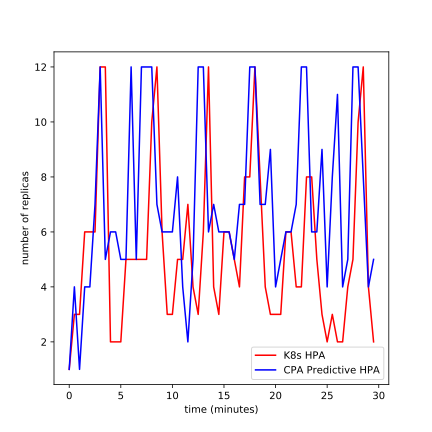
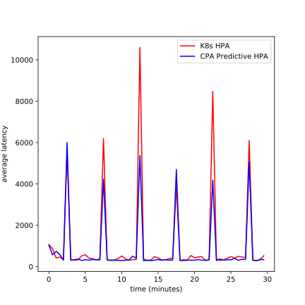
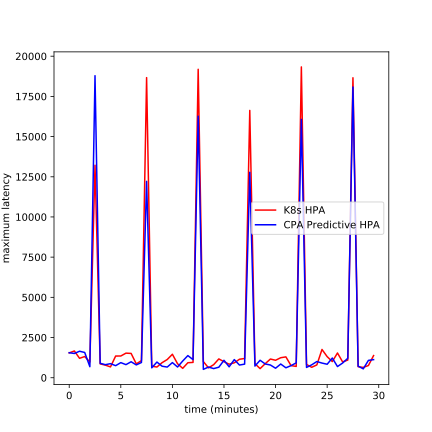
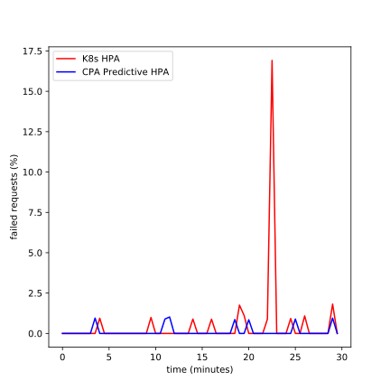

# Introduction

Kubernetes in its current state allows setting how many pods a deployment has, allowing you to set a target amount of pods it should have and Kubernetes will reconcile this and ensure that it reaches that target.  

Kubernetes provides the Horizontal Pod Autoscaler (HPA) which allows automatic scaling of the number of pods a deployment has based on metrics that you feed into the HPA. Generally these metrics are CPU/memory load of the pod, allowing scaling up if the load gets too much or down if resources are underutilized; but also includes custom metrics defined through the metrics API. The HPA takes these metrics and applies a built in algorithm to them to determine the number of pods to scale up/down.

## Problems

There are two problems in the current Kubernetes HPA setup:

- Hard-coded algorithm with less flexibility.
- Custom metrics can be difficult to set up.

### Hard-coded Algorithm

The built in algorithm may not suit your needs; you may require more complex scaling logic. The only way to currently resolve this is to write your own scaler from scratch, which is a
complex and difficult task - with an added vector of failure if there are bugs in your scaling. Writing this scaler requires an intimate understanding of Kubernetes and its APIs.

### Custom Metrics Difficulty

Custom metrics requires the use of third party adapters (e.g. Prometheus), or requires the user to write their own adapter. This requires a lot of configuration, and in the case of writing their own adapter requires in-depth Kubernetes API knowledge.

## Existing Attempts at Solutions

### Horizontal Pod Autoscaler with Custom Metrics

### Agones Fleet Autoscaler

# Solution

The Custom Pod Autoscaler Framework (CPAF) is designed to address these two problems. The CPAF would work by allowing the creation of Custom Pod Autoscalers (CPA) and letting them run inside a Kubernetes cluster.  

The CPA would contain custom user defined logic for scaling, alongside a base program to handle interactions with Kubernetes and triggering the user defined logic. The CPA would
allow for very simple scaling code to be written, in a variety of languages and with different technologies, while hiding the complexities of Kubernetes.

## Customisation

## Ease of Use

# Requirements

## Must Have

- Can deploy a Docker image with autoscaling application into a Kubernetes cluster.
- Autoscaler repeatedly runs.
- Supports user logic, can triggered through a shell command, allows specification in any language/framework that supports being called through shell commands.
    - Supports HTTP requests from user logic.
- If user logic specifies that the number of replicas should change, scaling should occur and the number of pods should be adjusted.
- \>= 70% Unit test coverage.
- Can be deployed with Kubernetes YAML.
- Kubernetes Custom Resource specifiying the Custom Pod Autoscaler to allow for simpler and easier deployment/configuration.
- Syntax validation for Custom Pod Autoscaler Kubernetes YAML.
- Deploying the Kubernetes Custom Resource should provision all required Kubernetes resources for the autoscaler.
- Can deliver configuration options through Kubernetes YAML.
- Can deliver configuration options through a supplied configuration file baked into the autoscaler image.
- Configuration options.
    - How frequently the autoscaler runs.
    - Minimum and Maximum replicas
    - Which resource to target for scaling.
    - Timeouts for metric and evaluation gathering.
- Can delete the autoscaler.
    - Deletes all associated Kubernetes resources.

## Should Have

- *Cooldown* feature to avoid *thrashing*.
- Allow choosing which pods to terminate when scaling down.
- Manual triggering of the Custom Pod Autoscaler metric gathering and evaluation through an API.
    - Provide a *dry run* flag to the API to allow seeing how the autoscaler would scale without applying the results.
- Hooks for different actions/stages in the autoscaling process.
- Support scaling all resources the Horizontal Pod Autoscaler can scale.
    - ReplicaSets.
    - ReplicationControllers.
    - StatefulSets.
    - Deployments.
- Methods for calling user logic.
    - Can trigger user logic through an HTTP request, allowing logic to exist outside of the autoscaling pod, or even outside of the cluster.
- Metric gathering modes.
    - Can run in a *per pod* autoscaling mode, which will run metric gathering for each pod the targeted resource manages.
    - Can run in a *per resource* autoscaling mode, which will run metric gathering only once for the targeted resource.
- Full customisation of Kubernetes resources, allowing Custom Pod Autoscalers to define their own resource dependencies.
    - When this customised resource is provided, the Custom Pod Autoscaler should have ownership; meaning if the autoscaler is deleted the resource is deleted.
- Custom Pod Autoscaler GUI.
    - GUI to view and manage custom pod autoscalers.
- Implemented Custom Pod Autoscalers
    - Horizontal Pod Autoscaler; reimplemented as a Custom Pod Autoscaler.
    - Predictive Horizontal Pod Autoscaler; Horizontal Pod Autoscaler extended with statistical prediction techniques.
    - Load Testing Pod Autoscaler; autoscaler allowing scaling based on realtime load tested data.
    - Examples to help developers.
        - Autoscaler written in Python.
        - Autoscaler written in Golang.
        - Autoscaler that scales based on Twitter activity.

# Design

A Custom Pod Autoscaler (CPA) would be a single docker image that manages a deployment, handling scaling. It would be responsible for gathering metrics, making evaluations and interacting with Kubernetes to scale the deployments it manages.

## Custom Pod Autoscaler Base

The Custom Pod Autoscaler Base (CPAB) would be a program that would handle all complexities when interacting with Kubernetes and the API. This program would provide a base for users to write their own logic on top of, while abstracting away much of the complexity. The program would be highly configurable.  

The CPAB would be built by me as part of this project. The CPAB would be distributed as both a binary and within a set of Docker images that could be extended easily to include custom user defined logic.

#### Autoscaler

#### Rest API

### User Defined Logic

User Defined Logic (UDL) would be the customised programs written by users of the CPA. The UDL would be split into two parts, metric gathering and evaluations. 

#### Methods

UDL would be accessed and triggered through a shell command that would be part of the configuration options of the CPAB. This would allow for flexibility on how the user wants to implement their metric gathering and evaluation logic; they could do it mostly in any way they wanted (Python, Golang, Java etc.). The only requirement would be that then logic has to be
started by a shell command. Specifications on how UDL should receive data and output results would have to be created for users to be able to implement their own logic.

#### Metric Gathering

Metric gathering would take in the pods in a deployment being managed, and output any metrics it gathers/generates.

#### Evaluating

The evaluation would take the metrics gathered/generated by the metric gathering and make a decision on how to scale a deployment, outputting its decision.

### Configuration Options

### Kubernetes Resources

Running the CPA in a Kubernetes cluster would require some configuration in the cluster.
The CPA would require a single pod deployment to run in; Kubernetes would manage this
deployment. Further configuration is also required to allow the CPA to interact with 
deployments and pods in the cluster; requiring a Service Account, a Role and a Role
Binding. This could be manually set up by the user, but could be difficult to set up and time
consuming, to address this an operator would be offered to allow easy install.  

Required Resources:  

- Deployment.
- Service Account.
- Role.
- Role Binding.

## Custom Pod Autoscaler Operator

The Custom Pod Autoscaler Operator (CPAO) would allow for quick and easy creation of
CPAs, taking in a Kubernetes custom resource description of the CPA and provisioning all
required Kubernetes resources to get it running and allow it to interact with the parts of the
cluster it needs. The CPAO uses a Kubernetes controller to handle the actual
implementation and logic of provisioning the required resources.
Kubernetes documentation describes the combining of the custom resource and controller
as part of the Operator pattern - and there is a framework called the Operator Framework
designed for this end. The Operator Framework provides an SDK for developing operators.
Implementation of these would allow for a smooth process for creating custom scalers and
deploying them to clusters, allowing custom scaling logic and easy metric gathering with little
overhead.

The Custom Pod Autoscaler Controller would be written in Go using the Operator SDK by
me as part of this Project. It would be distributed as a Docker image.

### Custom Pod Autoscaler Custom Resource

A custom resource in Kubernetes is an extension of the Kubernetes API that allows a short hand for quickly installing/deploying resources. CPAs would be set up as a custom resource
on the cluster. The custom resource would allow users to define a CPA in a concise way, allowing for quick and easy install.  
The Custom Pod Autoscaler Custom Resource would be defined by me in YAML and provided as part of the process for installing a CPAO.

### Custom Pod Autoscaler Controller

A controller in Kubernetes is the implementation of the custom resource API, allowing logic to be written for creation/updating/deleting custom resources. Paired with the idea that the CPA is a custom resource would be the use of a controller in Kubernetes to allow implementation of logic for managing CPAs.  

The controller would handle provisioning the following:

- A single pod deployment to run the CPA in.
- A service account for the CPA to use when interacting with the Kubernetes API.
- A role binding describing the required API access for the CPA.
- A role to tie the service account to the role binding.
- Deploying these to the correct namespace.

### Kubernetes Resources

# Implementation

## Language

## Libraries

## Operator Framework

# Testing

# Experiments

## Predictive Horizontal Pod Autoscaler comparision with Horizontal Pod Autoscaler for seasonal loads

### Overview

This experiment compares the performance of the CPA Predictive Horizontal Pod Autoscaler and the K8s Horizontal Pod Autoscaler for regular, seasonal loads.  

The experiment runs a sample application, and uses the autoscalers to monitor it. [Locust](https://github.com/locustio/locust) is used to simulate load, a low level of load is applied throughout the experiment; every 5 minutes an increased load is used, which should cause the autoscalers to react to this. The experiment runs these increased loads 6 times, meaning the experiment runs for 30 minutes per autoscaler.  

The number of replicas for each managed deployment are monitored and gathered for the duration of the experiment, alongside latency statistics (average latency, maximum latency, number of failed requests).

### Results

|   time (mins) |   hpa num requests |   phpa num requests |   hpa replicas |   phpa replicas |   hpa avg latencies |   phpa avg latencies |   hpa max latencies |   phpa max latencies |   hpa fail requests (%) |   phpa fail requests (%) |
|--------------:|-------------------:|--------------------:|---------------:|----------------:|--------------------:|---------------------:|--------------------:|---------------------:|------------------------:|-------------------------:|
|           0   |                 58 |                  58 |              1 |               1 |            1071.08  |             1046.48  |            1543.99  |             1554.96  |                0        |                 0        |
|           0.5 |                 69 |                  85 |              3 |               4 |             861.354 |              568.63  |            1663.62  |             1508.04  |                0        |                 0        |
|           1   |                 99 |                  76 |              3 |               1 |             418.918 |              743.427 |            1207.28  |             1647.04  |                0        |                 0        |
|           1.5 |                100 |                  84 |              6 |               4 |             461.489 |              584.044 |            1317.05  |             1570.56  |                0        |                 0        |
|           2   |                115 |                 112 |              6 |               4 |             336.131 |              311.377 |             978.603 |              686.993 |                0        |                 0        |
|           2.5 |                254 |                 237 |              6 |               7 |            5556.8   |             6000.52  |           13216.2   |            18785.7   |                0        |                 0        |
|           3   |                113 |                 113 |             12 |              12 |             334.859 |              316.591 |             861.098 |              896.165 |                0        |                 0        |
|           3.5 |                116 |                 105 |             12 |               5 |             309.993 |              325.734 |             782.169 |              810.482 |                0        |                 0.952381 |
|           4   |                106 |                 110 |              2 |               6 |             326.172 |              369.268 |             672.583 |              874.444 |                0.943396 |                 0        |
|           4.5 |                 88 |                 122 |              2 |               6 |             521.03  |              299.501 |            1348.81  |              749.325 |                0        |                 0        |
|           5   |                 87 |                 112 |              2 |               5 |             577.83  |              335.135 |            1350.81  |              937.705 |                0        |                 0        |
|           5.5 |                105 |                 110 |              5 |               5 |             413.187 |              313.814 |            1528.39  |              814.117 |                0        |                 0        |
|           6   |                109 |                 112 |              5 |              12 |             384.049 |              342.136 |            1510.96  |              992.412 |                0        |                 0        |
|           6.5 |                113 |                 110 |              5 |               5 |             335.448 |              333.09  |             859.656 |              795.913 |                0        |                 0        |
|           7   |                109 |                 111 |              5 |              12 |             373.158 |              323.617 |            1063.37  |              947.122 |                0        |                 0        |
|           7.5 |                217 |                 363 |              5 |              12 |            6201.21  |             4225.69  |           18667     |            12213.8   |                0        |                 0        |
|           8   |                114 |                 112 |             10 |              12 |             318.605 |              326.716 |             715.911 |              615.69  |                0        |                 0        |
|           8.5 |                117 |                 116 |             12 |               7 |             295.887 |              317.116 |             664.91  |              973.644 |                0        |                 0        |
|           9   |                111 |                 114 |              6 |               6 |             330.826 |              305.746 |             935.576 |              715.099 |                0        |                 0        |
|           9.5 |                101 |                 114 |              3 |               6 |             390.03  |              307.549 |            1131.6   |              662.726 |                0.990099 |                 0        |
|          10   |                 95 |                 117 |              3 |               6 |             515.758 |              294.92  |            1457.9   |              940.206 |                0        |                 0        |
|          10.5 |                107 |                 115 |              5 |               8 |             380.451 |              308.294 |             868.805 |              666.322 |                0        |                 0        |
|          11   |                111 |                 112 |              5 |               4 |             308.075 |              321.059 |             583.02  |             1038.38  |                0        |                 0.892857 |
|          11.5 |                113 |                  98 |              7 |               2 |             339.696 |              504.942 |             932.274 |             1375.89  |                0        |                 1.02041  |
|          12   |                109 |                 104 |              4 |               5 |             339.59  |              406.901 |             952.15  |             1125.55  |                0        |                 0        |
|          12.5 |                120 |                 261 |              3 |              12 |           10608.4   |             5376.01  |           19184.4   |            16267.3   |                0        |                 0        |
|          13   |                106 |                 118 |              6 |              12 |             382.154 |              283.533 |            1004.56  |              519.533 |                0        |                 0        |
|          13.5 |                113 |                 113 |             12 |               6 |             299.077 |              312.096 |             613.244 |              663.481 |                0        |                 0        |
|          14   |                112 |                 113 |              4 |               7 |             321.101 |              296.591 |             811.244 |              567.841 |                0.892857 |                 0        |
|          14.5 |                 92 |                 113 |              3 |               6 |             483.31  |              309.718 |            1169.26  |              652.943 |                0        |                 0        |
|          15   |                100 |                 109 |              6 |               6 |             423.651 |              344.859 |             995.951 |             1083.17  |                0        |                 0        |
|          15.5 |                115 |                 112 |              6 |               6 |             318.291 |              312.148 |             840.216 |              678.878 |                0        |                 0        |
|          16   |                113 |                 106 |              5 |               5 |             330.3   |              331.369 |             926.912 |             1126.49  |                0.884956 |                 0        |
|          16.5 |                105 |                 114 |              4 |               7 |             379.08  |              314.621 |            1148.97  |              787.824 |                0        |                 0        |
|          17   |                103 |                 112 |              8 |               7 |             420.2   |              321.541 |            1193.36  |              845.193 |                0        |                 0        |
|          17.5 |                329 |                 308 |              8 |              12 |            3896.27  |             4698.3   |           16625.4   |            12775.3   |                0        |                 0        |
|          18   |                113 |                 115 |             12 |              12 |             318.795 |              291.669 |             875.649 |              725.185 |                0        |                 0        |
|          18.5 |                117 |                 116 |              8 |               7 |             287.923 |              328.177 |             565.064 |             1084.45  |                0        |                 0.862069 |
|          19   |                114 |                 114 |              4 |               7 |             310.497 |              315.846 |             873.931 |              855.343 |                1.75439  |                 0        |
|          19.5 |                 90 |                 116 |              3 |               9 |             537.404 |              308.124 |            1162.89  |              790.527 |                1.11111  |                 0        |
|          20   |                100 |                 118 |              3 |               4 |             429.276 |              309.821 |            1085.01  |              590.321 |                0        |                 0.847458 |
|          20.5 |                 96 |                 106 |              3 |               5 |             461.945 |              341.4   |            1243.45  |              851.372 |                0        |                 0        |
|          21   |                 93 |                 113 |              6 |               6 |             486.003 |              314.128 |            1295.48  |              617.072 |                0        |                 0        |
|          21.5 |                114 |                 117 |              6 |               6 |             297.189 |              311.115 |             753.041 |              753.379 |                0        |                 0        |
|          22   |                113 |                 114 |              4 |               7 |             326.585 |              331.382 |             703.009 |              921.999 |                0.884956 |                 0        |
|          22.5 |                136 |                 326 |              4 |              12 |            8470.04  |             4179.32  |           19331.7   |            16069.6   |               16.9118   |                 0        |
|          23   |                108 |                 116 |              8 |              12 |             379.258 |              295.705 |             824.922 |              640.017 |                0        |                 0        |
|          23.5 |                117 |                 107 |              8 |               6 |             296.945 |              368.871 |             647.996 |              800.754 |                0        |                 0        |
|          24   |                108 |                 113 |              5 |               6 |             332.407 |              312.359 |             796.379 |             1005.54  |                0        |                 0        |
|          24.5 |                108 |                 114 |              3 |               9 |             404.661 |              334.533 |            1756.5   |              910.706 |                0.925926 |                 0        |
|          25   |                 89 |                 112 |              2 |               4 |             489.521 |              329.008 |            1311.6   |              838.021 |                0        |                 0.892857 |
|          25.5 |                104 |                 110 |              3 |               8 |             420.374 |              403.22  |            1004.71  |             1223.52  |                0        |                 0        |
|          26   |                 92 |                 116 |              2 |              11 |             495.535 |              302.696 |            1537.19  |              694.613 |                1.08696  |                 0        |
|          26.5 |                 93 |                 114 |              2 |               4 |             469.846 |              357.875 |             982.837 |              913.938 |                0        |                 0        |
|          27   |                 97 |                 108 |              4 |               5 |             438.81  |              346.192 |            1097.82  |             1209.86  |                0        |                 0        |
|          27.5 |                207 |                 278 |              5 |              12 |            6098.44  |             5063.39  |           18656.8   |            18080.2   |                0        |                 0        |
|          28   |                115 |                 112 |             10 |              12 |             307.615 |              327.37  |             686.512 |              720.34  |                0        |                 0        |
|          28.5 |                117 |                 116 |             12 |               8 |             288.367 |              288.007 |             640.26  |              551.498 |                0        |                 0        |
|          29   |                110 |                 105 |              4 |               4 |             330.458 |              351.79  |             758.71  |             1078.44  |                1.81818  |                 0.952381 |
|          29.5 |                 88 |                 107 |              2 |               5 |             530.607 |              335.193 |            1376.68  |             1125.07  |                0        |                 0        |

### Conclusion

Figure \ref{phpa_vs_horz_replicas} shows that initially the Predictive Horizontal Pod Autoscaler (PHPA) and the Horizontal Pod Autoscaler (HPA) have similar scaling results, as they both use the same underlying logic; and the PHPA has not got any data to base its predictions on yet so uses the normal HPA logic. After the PHPA accumulates some data it begins to use this data to predict upcoming replicas.  

Figure \ref{php_vs_horz_avg_latency} and figure \ref{php_vs_horz_max_latency} shows that while the K8s HPA and the PHPA had similar latencies at the start of the run, as more data became available to the PHPA it began to predict using it and reduce the latency spikes for seasonal loads.  

Figure \ref{php_vs_horz_fail_request} shows that the K8s HPA and the PHPA had similar failed request rates in the beginning, but as more data became available to the PHPA it began to predict using it and reduce failed requests for seasonal loads.

