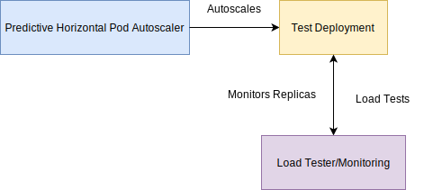
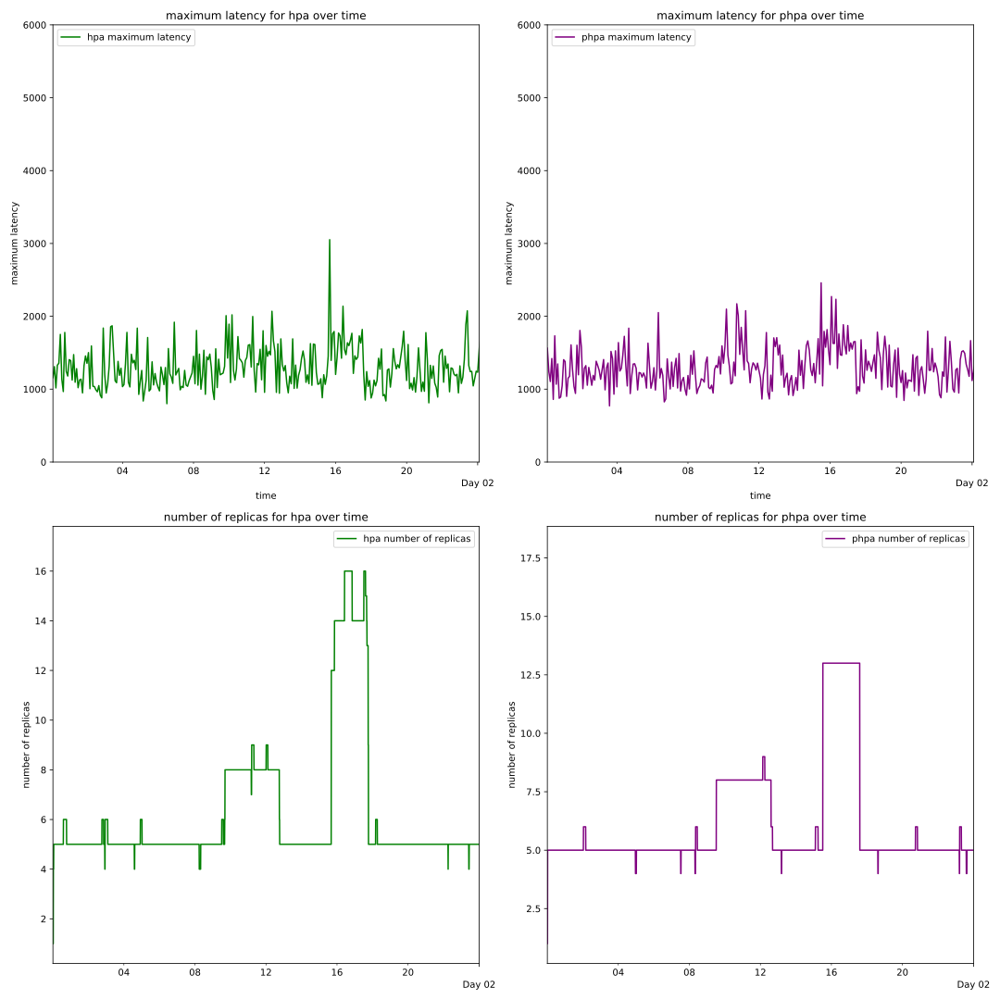
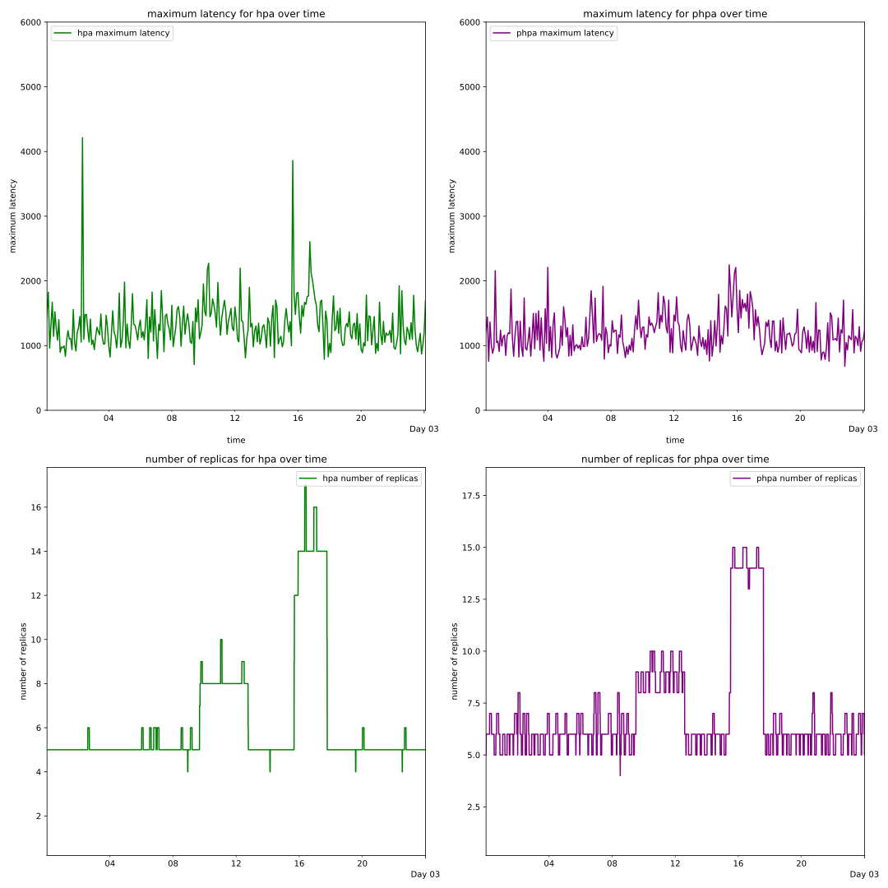
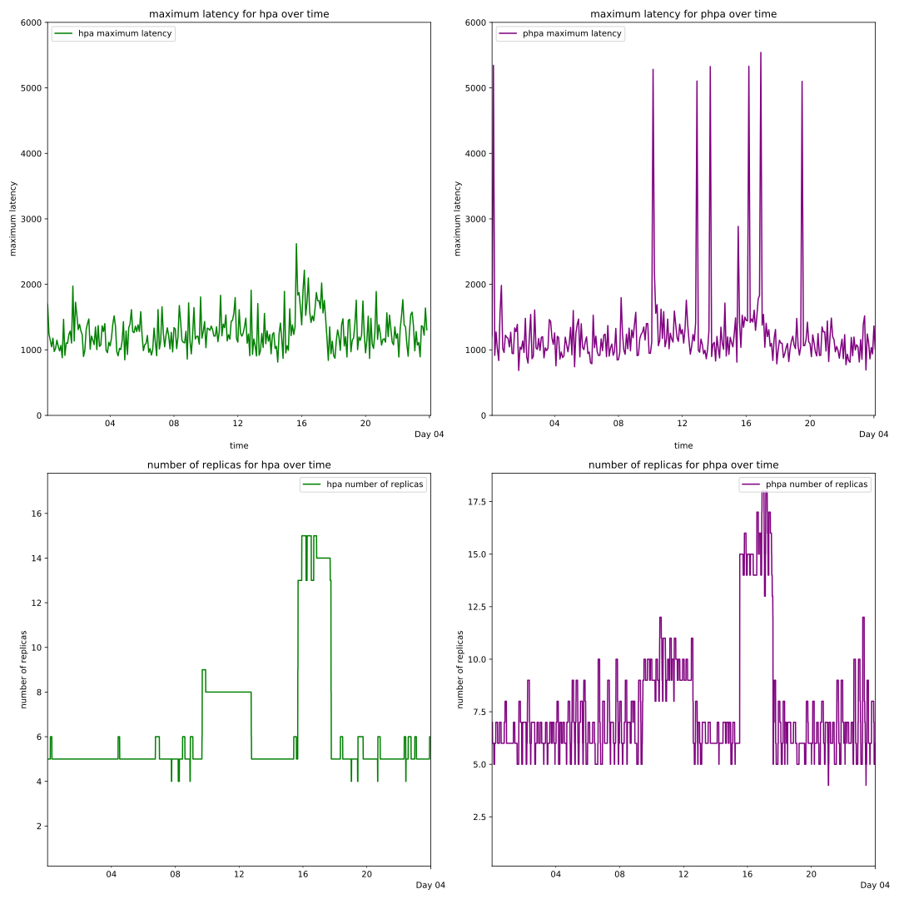

# Introduction

All source code for this project can be found on GitHub
[@cpa_github;@cpao_github].  

Kubernetes (K8s) is a container orchestration system, which allows sharing
compute resources between applications that run on it [@k8s_main_page]. K8s uses the abstractions
of *pods* and *resources* to represent these compute resources. A pod is
analogous to a container, while a resource is an application and the pods that
the application is running on.

A key abstraction that K8s is built upon is the concept of *containers*.
Containers come in a number of forms, with different *container engines*
providing different forms of container; which vary slightly but follow the same
key principles. *Docker* is one such container engine, and is well supported by
K8s - this project extensively uses Docker.

> A container is a standard unit of software that packages up code and all its
> dependencies so the application runs quickly and reliably from one computing
> environment to another. A Docker container image is a lightweight, standalone,
> executable package of software that includes everything needed to run an
> application: code, runtime, system tools, system libraries and settings.
> [@docker_container]

K8s uses containers to provide more or less compute resources for applications -
packed up as a pod. A pod is a singular or collection of containers, that act as
a single service. 'A Pod (as in a pod of whales or pea pod) is a group of one or
more containers (such as Docker containers), with shared storage/network, and a
specification for how to run the containers. [@k8s_pod_concept]' 

K8s provides a system for hosting and managing applications in an elastic
fashion, with the use of a microservice approach. This approach allows a
Kubernetes cluster to utilise multiple *nodes*, a node is a physical or virtual
machine. These nodes are managed by K8s as part of a cluster, with the compute
resources they provide shared between applications running on the cluster. This
approach is elastic and scalable, allowing the resources available to all
applications on the cluster to be scaled by adding or removing nodes.

> A node is a worker machine in Kubernetes, previously known as a minion. A node
> may be a VM or physical machine, depending on the cluster. Each node contains
> the services necessary to run pods and is managed by the master components.
> [@k8s_node_concept]

K8s has seen widespread adoption, as figure \ref{k8s_adoption} shows the top 4
most used container orchestration tools are all forms of managed K8s providers.
This widespread adoption has led to a large community forming around K8s, with a
variety of open source libraries, frameworks and toolkits being created to work
with K8s.

![Container Orchestration tool
choice\label{k8s_adoption}
[@container_adoption_survey]](assets/intro/kubernetes_adoption.png)

K8s in its current state allows setting how many pods a resource has, by setting
a target amount of pods a resource should have K8s will reconcile the actual
number of pods to the target number of pods. This reconciliation involves
provisioning new pods to scale upwards, or terminating existing pods to scale
downwards. The reconciliation process will provision pods for a resource if
there is capacity and compute resources available to do so on the cluster's
nodes.

K8s provides the *Horizontal Pod Autoscaler* (HPA) which allows automatic scaling
of the number of pods a resource has based on metrics that are fed into the
HPA. Generally these metrics are CPU/memory load of the pod, allowing scaling up
if the load gets too much or down if resources are underutilized; but also
includes custom metrics defined through the metrics API. The HPA takes these
metrics and applies a built in algorithm to them to determine the number of pods
to scale up/down. This process is called *autoscaling*.

## Problems

There are two problems in the current K8s HPA setup:

- Hard-coded algorithm with limited flexibility.
- Custom metrics can be difficult to set up.

### Hard-coded Algorithm

The HPA built in algorithm is:

```
desiredReplicas = ceil[currentReplicas * ( currentMetricValue / desiredMetricValue )]
```
[@kubernetes_io_hpa]

The built in algorithm may not suit your needs; you may require more complex 
scaling logic. For example, a queue based autoscaling solution, an autoscaler
that uses conditional logic with twitter statistics or a predictive autoscaling
solution. The only way to currently resolve this is to write your own  scaler
from scratch, which is a complex and difficult task - with an added vector of
failure if there are bugs in your scaler. Furthermore, writing this scaler
requires an intimate understanding of K8s and its APIs.

### Custom Metrics Difficulty

Custom metrics require the use of third party adapters (e.g. Prometheus, Sysdig
Monitor), or requires the user to write their own adapter. This depends on a lot
of configuration and in the case of writing their own adapter necessitates
in-depth K8s API knowledge. See figure \ref{sysdig_scaler_overview} for an
example Sysdig autoscaling system and figure \ref{general_custom_metrics} for a
generalised system.

![Sysdig Custom Metrics autoscaling overview\label{sysdig_scaler_overview}
[@sysdig_custom_metrics]](assets/intro/sysdig_kubernetes_scaler_overview.png)


## Users

There are three key users that are affected by the current problems with the
current K8s autoscaling setup:

- Developer
- Cluster Administrator
- Consumer

There is overlap in these users, a user may fit both the Developer and Cluster
Administrator categories, or any mix of categories.

### Developer

The Developer is the user that builds custom autoscalers, the problem that
they face is that custom autoscalers are difficult and time consuming to create;
with an added overhead of testing, maintenance and responsibility for a complete
custom autoscaling system. The developer must have in-depth K8s knowledge to
develop the custom autoscaler, which is an investment of time and effort.

### Cluster Administrator

The Cluster Administrator is the user that is responsible for K8s cluster
operations, deploying autoscalers and determining which autoscaling metrics to
use. This user faces the issue that a complex HPA integration, using third party
adapters and tooling is complicated to configure and maintain. The complexity of
these autoscaling systems can make them brittle and easy to break. 

### Consumer

The Consumer is the user that accesses the application running on the K8s
cluster that is being managed by an autoscaler. The problems this user can face
is less responsive applications, or an increased cost in using the service; due
to lack of flexiblity in autoscaling solutions to manage compute resources.

## Existing Attempts at Solutions

### Horizontal Pod Autoscaler with Custom Metrics

Augmenting the HPA with *custom metrics* goes some way in addressing the
problems, granting greater flexibilty beyond standard K8s metrics - which are
limited to measurements such as CPU and memory use. Custom metrics are
user-defined metrics, which can be generated by other applications and
integrated with standard K8s metrics. The custom metrics approach allows
supplying more data to the HPA to use for scaling, granting a Cluster
Administrator user greater control over the autoscaling process.  

This approach does not address all of the problems. This approach still
ultimately relies on the hard-coded HPA scaling algorithm, which can can make a
scaling technique using this very complex, or even ultimately could block a
certain method entirely. The custom metrics style of autoscaling has an added
overhead in complexity, with third-party adapters and applications required to
generate, collect and feed the custom metrics into the K8s metrics API. This
requires more maintenance, configuration and understanding of a variety of
systems to augment the K8s cluster.

### Agones Fleet Autoscaler

>Agones is a library for hosting, running and scaling dedicated game servers on
>Kubernetes. 
[@agones_overview]

Agones provides a custom autoscaler for the Agones game hosting K8s framework.
This autoscaler is called the *Fleet Autoscaler*, this autoscaler is designed to
scale game servers - allowing the use of a buffer based autoscaling strategy, or
a webhook driven strategy; allowing the injection of custom autoscaling logic.

Buffer based autoscaling works by ensuring there are always between a minimum
and maximum number of spare game servers with free capacity available; this is
an alternative to autoscaling based on other metrics such as CPU usage or
memory, which would not make sense for a game server.

This webhook driven autoscaling works by allowing users to deploy a web server
to respond to webhooks and configuring the autoscaler to send HTTPS requests to
this web server to determine how to scale. The web server responds with a
standard response on how to scale the resource
[@agones_autoscaler_specification].

The Agones Fleet Autoscaler addresses many of the issues highlighted - providing
an alternative to the hard-coded autoscaling algorithm of the HPA through the
buffer and webhook driven autoscaling techniques. The webhook method provides
the ability to inject custom user written logic, exposed through an HTTP API.
This would allow a developer to create custom autoscaling and allow a cluster
administrator to apply different scaling techniques.

The drawback of the Agones Fleet Autoscaler is that it is only available as part
of the Agones ecosystem. The autoscaler is not generalised and requires the use
of Agones abstractions such as *fleets*, which prevent it from being deployed on
a standard K8s cluster. If a user wanted to utilise this autoscaling technique,
they would be required to use the entire Agones framework - which is built
exclusively for game server hosting and as such is not applicable to most
scenarios.

\newpage

# Solution

The Custom Pod Autoscaler Framework (CPAF) is designed to address these two 
problems. The CPAF would work by allowing the creation of Custom Pod 
Autoscalers (CPA) and letting them run inside a standard K8s cluster.  

A CPA would contain custom User Defined Logic (UDL) for scaling, alongside a base 
program to handle interactions with K8s and triggering the user defined 
logic. The CPA would allow for very simple scaling code to be written, in a 
variety of languages and with different technologies, while hiding the 
complexities of K8s. All core scaling logic would be handled by UDL, while
complexities such as K8s API interaction would be hidden by the base program.

## Customisation

A CPA would contain a base program that would interact with user provided 
logic; which can be in the form of any executable code such as Python script, 
or it could even be a separate service which would respond to HTTP requests. 
The CPA would define a standard API for interacting with the CPA; using this 
users could write their own logic to interact with it.  

Primarily a series of inputs and ouputs would be defined, to allow user logic 
to be created that can reliably execute based on input and produce parsable 
results. This would allow for essentially any program or logic to be used as 
part of an autoscaler; using any language or framework, as long as it can run 
inside a Docker container.  

Alongside this the CPA base program itself should be highly customisable; 
allowing customising on the same lines that the Horizontal Pod Autoscaler can 
be customised; for example setting the interval between making autoscaling 
decisions. The CPA base program should allow customisation at both deploy time 
and build time, to allow autoscaler developers to set sensible default values, 
whilst also allowing users of the autoscaler to customise it to their needs.

## Ease of Use

Both creating a CPA and deploying it should be easy and not require lots of 
configuration, third party deployments or intricate K8s API knowledge.

### Creating a Custom Pod Autoscaler

CPAs should be extremely flexible in how they are created, supporting a wide 
variety of languages, frameworks, environments, and interfaces. The CPAF should
provide a variety of ways to integrate UDL, through shell commands, HTTP
commands, future methods should be able to be added without breaking changes.

### Deploying a Custom Pod Autoscaler

CPAs should be deployed in the standard way to deploy to K8s, through 
K8s deployment YAML. This is flexible and also has the benefit of 
including compatiblity with some other commonly used tools, such as Helm.  

Deploying through K8s YAML provides the benefit of familiarity and 
consistency with other parts of K8s; whilst also allowing more 
transparancy in versioning, resources used and deploy time customisation.  

The deployment YAML should be as simple as possible and without obscure or 
confusing resources included; much of the complexity should be abstracted away 
from the deploying user, whilst also retaining a level of customisation at 
deploy time. This could be achieved with a custom K8s resource and some 
logic in the form of a K8s controller or operator for managing the 
resource.  

Once a Custom Pod Autoscaler is deployed, it should be easy to interact with - 
it should provide a versioned HTTP REST API for retrieving information and for 
triggering autoscaling.

\newpage

# Requirements

## Must Have

- Can deploy a Docker image with autoscaling application into a K8s cluster.
  - Multiple distributed Docker images for various languages/environments.
    - Python Docker image.
    - Alpine Docker image.
- Can deploy onto any standard K8s cluster, without third party requirements or
  dependencies.
- Autoscaler repeatedly runs.
- Supports user logic, can triggered through a shell command, allows
  specification in any language/framework that supports being called through
  shell commands. 
  - Supports HTTP requests from user logic.
- If user logic specifies that the number of replicas should change, scaling
  should be requested and the number of pods should be adjusted. 
- Can be deployed with K8s YAML.
- K8s Custom Resource specifiying the Custom Pod Autoscaler to allow for simpler
  and easier deployment/configuration. 
- Deploying the K8s Custom Resource should provision all required K8s resources
  for the autoscaler. 
- Can deliver configuration options through K8s YAML.
- Can deliver configuration options through a supplied configuration file baked
  into the autoscaler image. 
- Configuration options.
  - How frequently the autoscaler runs.
  - Minimum and maximum replicas.
  - Which resource to target for scaling.
  - Timeouts for metric and evaluation gathering.
- Can delete the autoscaler.
  - Deletes all associated K8s resources.

## Should Have

- *Cooldown* feature to avoid *thrashing*.
  - Thrashing is when a resource is scaled up and down repeatedly in a short
    period of time, caused by being right on the threshold of an evaluation. For
    example, if the number of pods in a resource rapidly changes between 2 and
    3 because of small changes in the metrics as it is directly on a
    boundary/threshold.
  - Cooldown would allow defining a time period to gather metrics in and scale
    the highest value in that window. This would ensure that downscaling did not
    happen too quickly or erratically and help smooth out the number of
    replicas over time.
- Manual triggering of the Custom Pod Autoscaler metric gathering and evaluation
  through an API.
  - Rather than being triggered just by the timer and at set intervals, the
    Custom Pod Autoscaler evaluation could be triggered manually, through a REST
    endpoint.
  - This would allow users to send an HTTP request to the Custom Pod Autoscaler
    and start an evaluation immediately, rather than waiting for the interval to
    expire.
  - Provide a *dry run* flag to the API to allow seeing how the autoscaler would
    scale without applying the results. 
- Support scaling all resources the Horizontal Pod Autoscaler can scale.
  - ReplicaSets.
  - ReplicationControllers.
  - StatefulSets.
  - Deployments.
- Metric gathering modes.
  - Can run in a *per pod* autoscaling mode, which will run metric gathering 
    for each pod the targeted resource manages.
  - Can run in a *per resource* autoscaling mode, which will run metric 
    gathering only once for the targeted resource.
- Full customisation of K8s resources, allowing Custom Pod Autoscalers to define
  their own resource dependencies. 
  - When this customised resource is provided, the Custom Pod Autoscaler should
    have ownership; meaning if the autoscaler is deleted the resource is
    deleted. 
- Implemented Custom Pod Autoscalers
  - Examples to help developers.
    - Autoscaler written in Python.
    - Autoscaler written in Golang.
    - Autoscaler that scales based on Twitter activity.
- \>= 70% Unit test coverage.

## Could Have

- Hooks for different actions/stages in the autoscaling process.
  - Hooks would be points at which a user-defined shell command is executed, to
    allow users to have greater control of the Custom Pod Autoscaler. 
      - Before metric gathering.
      - After metric gathering.
      - Before evaluation.
      - After evaluation.
      - Before scaling.
      - After scaling.
- Methods for calling user logic.
  - Can trigger user logic through an HTTP request, allowing logic to exist 
    outside of the autoscaling pod, or even outside of the cluster.
- Allow choosing which pods to terminate when scaling down.
  - The CPA evaluator could decide which pods to terminate when scaling down,
    rather than relying on the K8s decision making which bases it on how
    old the pod is.
  - This could be a list of pods with priorities assigned to them, with the
    lowest priority pods terminated when scaling down as needed.
- Implemented Custom Pod Autoscalers
  - Horizontal Pod Autoscaler; reimplemented as a Custom Pod Autoscaler.
  - Predictive Horizontal Pod Autoscaler; Horizontal Pod Autoscaler extended
    with statistical prediction techniques.
  - Load Testing Pod Autoscaler; autoscaler allowing scaling based on realtime
    load tested data. 
- Custom Pod Autoscaler GUI.
  - GUI to view and manage custom pod autoscalers.

\newpage

# Design

The Custom Pod Autoscaler Framework (CPAF) is a combination of systems for
the creation, management and running of Custom Pod Autoscalers (CPA) - with ease
of development, use, and configuration of K8s autoscalers as the primary
goal. A Custom Pod Autoscaler is a single docker image that manages a K8s
resource (such as a deployment) by handling scaling the resource up and down. It
is responsible for gathering metrics, making evaluations and interacting with
K8s to scale the resource it manages.

The CPAF is split up into two distinct parts, the Custom Pod Autoscaler and
the Custom Pod Autoscaler Operator (CPAO). The Custom Pod Autoscaler is further
split into two parts, the Custom Pod Autoscaler Base (CPAB) and User Defined
Logic (UDL). See figure \ref{cpaf} for an overview.  


## User Defined Logic

User Defined Logic (UDL) is the customised programs written by developer
users of the CPA. The UDL is split into two parts, metric gathering and
evaluations.  

UDL could exist either inside the Docker container, for example as a Python
script that is started by a shell command (see figure \ref{cpab_docker_inside});
or it could exist outside of the Docker container, for example as a service that
exposes a HTTP REST API (see figure \ref{cpab_docker_outside}).  

All UDL is able to produce errors and halt CPA execution by raising errors in a
standard way depending on the method used to call it, for example if using a
shell method a non-zero exit code represents an error and will stop execution.


### Metric Gathering

Metric Gathering UDL takes in information about the resource being managed, such
as a full deployment description and specification, or a full pod description
and specification. This input information has to be in a parsable and consistent
format, such as JSON or YAML. The Metric Gathering UDL then runs it's own
calculations and logic, defined by the CPA developer user, before returning any
calculated/gathered metrics.

### Evaluating

An evaluation is a decision that is the result of evaluation UDL - the
evaluation defines what the scaling target should be. The evaluation contains
all information required to set a scaling target - primarily containing the
target number of replicas a resource should have.  

Evaluation UDL takes in gathered metric information. This input information has
to be in a parsable and consistent format, such as JSON or YAML. The Evaluating
UDL then runs it's own calculations and logic, defined by the CPA developer
user, before returning any calculated evaluations in JSON.

## Custom Pod Autoscaler Base

The Custom Pod Autoscaler Base (CPAB) is a program that handles all interactions
with K8s through the K8s API. This program provides a base for users to write
their own logic on top of, while abstracting away much of the complexity. The
program is highly configurable.  

### Subsystems

The CPAB is structured as a collection of subsystems, with each subsystem
abstracting out a specific piece of functionality. These subsystems communicate
and interact together as a whole within the CPAB, see figure \ref{cpab} for an
overview. The CPAB is split into the following subsystems:

- Scaler
- Metric Gatherer
- Evaluator
- Autoscaler
- HTTP REST API


#### Scaler

The Scaler is part of the CPAB responsible for interfacing with the K8s API.
This part is provided a target replica count and the details of a K8s resource,
with this information it makes a request to the K8s Scaling API to target the
replica count provided. K8s will then apply its own processes and will scale the
resource to the target replica count if the cluster has capacity.

#### Metric Gatherer

The Metric Gatherer is the subsystem of the CPAB responsible for interacting with
the UDL to gather metrics. The Metric Gatherer takes input information about the
resource being managed and then feeds this into the UDL responsible for metric
gathering configured by the developer of the CPA. The Metric Gatherer then
parses the output from the UDL, catches any errors and then returns the metrics
retrieved from the UDL for other subsystems to use to make scaling decisions or
to expose data through the CPAB API.

#### Evaluator

The Evaluator is the part of the CPAB responsible for interfacing with the UDL to
make decisions on how to scale the resource being managed. The Evaluator takes
as input metrics that have been gathered by the Metric Gatherer; and then feeds
this into the UDL responsible for evaluating metrics configured by the developer
of the CPA. The Evaluator then parses the output from the UDL, catches any
errors and then returns evaluations retrieved from the UDL.

#### Autoscaler

The Autoscaler is the subsystem of the CPAB that handles repeatedly running at a
set interval, linking together the Metric Gatherer, Evaluator and Scaler
subsystems to automatically trigger the processes to gather metrics, evaluate
them before finally make a scaling request. This repeated process runs
concurrently to the rest of the application, without blocking any other part of
the program.

The Autoscaler is the full automatic scaling pipeline, which operates repeatedly
on a configured schedule. The Autoscaler first calls the Metric Gatherer to
retrieve metrics and then feeds these metrics into the Evaluator to retrieve an
evaluation, before finally sending this evaluation to the Scaler to scale the
resource through the K8s API. See figure \ref{autoscaler_overview} for an
overview of the autoscaler's flow.  

The Autoscaler fails safely; if user defined logic fails or crashes, or if the
autoscaler itself fails or crashs, it does not affect the resource being
managed. If the autoscaler crashes or fails, scaling does not occur; scaling
only occurs if the autoscaler processes all user defined logic and calculates an
evaluation correctly and without errors.  


#### HTTP REST API

The CPAB exposes a HTTP REST API for runtime interactions with the CPA. The API
allows triggering the autoscaler through a HTTP request, retrieving metrics
without evaluating and retrieving evaluations without scaling as part of a dry
run.  

This API allows the CPAB to be controlled externally, either through an
automated process or manually. This is highly useful, with the possibility of
automated control allowing integration of a CPA with a wider system. The ability
to manually control the CPAB is useful for development and testing of a CPA,
while also allowing administrators to have live control over the CPA.

The REST API is versioned to ensure compatiblity across new versions, starting
at API version `v1`. This is usable as `/api/<VERSION>/endpoint` to prevent
breaking API changes from disrupting systems/workflows.  

##### HTTP REST API v1

**Get Metrics**  
*Route* : `/api/v1/metrics`  
*Method* : `GET`  

Used to run metric gathering and return the results.

**Create Evaluation**  
*Route* : `/api/v1/evaluation`  
*Method* : `POST`  

Used to evaluate metrics and then scale based on them.

### Configuration Options

Configuration for the CPA is available at both container-build time and deploy
time. This configuration is provided through either a YAML configuration file
that is built into the Docker image at build time, or through environment
variables injected into the Docker container at runtime. Both configurations are
usable at the same time, with runtime configuration taking precedence and
overwriting the build time configuration.  

The following options are be configurable:

- The path to the configuration file (through an environment variable only).
- The interval between running the autoscaling pipeline and updating a
  resource's target replicas.
- The namespace of the resource being managed.
- Minimum replica target.
- Maximum replica target.
- The start time of the autoscaler, from this time the interval will be
  calculated, allowing the autoscaler to sync up with certain timings, such as
  running every 5 minutes starting exactly from the hour (e.g. 15:00, 15:05,
  15:10 etc.)
- How verbose the CPAB logs are.
- API configuration options.
  - Enable/disable the API.
  - Use HTTP/HTTPS for the API.
  - API port.
  - API host.
  - API certificate.
  - API private key.
- Downscale stabilization - this is a reimplemented K8s HPA feature, allowing a
  cooldown for downscaling to avoid thrashing; defines a time period and then
  only allows the autoscaler to scale to the maximum evaluation over this time
  period.

### Methods

UDL is accessed and triggered through an abstraction called *Methods*, which are
configurable ways to call and interact with User Defined Logic. A *Method* is
specified in configuration and this abstraction allows for different ways of
interacting with UDL to be available; while also allowing future additions of
new ways to interact in a non-breaking and consistent way.  

Each method has a clear specification to allow developers to fully understand
and utilise the framework, without running into issues around lack of
consistency or clarity.  

A method's input and output are be context based, requiring each possible
context that the method is called in to be fully specified and documented to
allow for a better developer experience.  

Each method has a timeout configuration option, allowing automatic timing out of
the method if it takes longer than the configured timeout; the method logic will
exit and a timeout error will occur.  

There are two available methods in the current CPAB:

- Shell Method
- HTTP Method

#### Shell Method

The Shell Method allows interaction through a shell command and the Unix pipe
system. This allows developers to create their UDL in a flexible way, supporting
any language and framework the developer wants to use (Python, Golang, Java
etc.) - the only requirement is it must be invokable by a shell command.  

The Shell Method is specified by providing the following:

- An entrypoint for the shell command, for example `/bin/bash`.
- The command to execute, for example `python script.py`.

#### HTTP Method

The HTTP Method allows interaction through HTTP calls. This allows developers to
expose an API for the CPAB to call and their UDL could run anywhere - within
the CPA Pod, another Pod in the K8s cluster, or even outside of the
K8s cluster. The only requirement for this is that it must expose HTTP
endpoints that can recieve and respond to HTTP calls.  

The HTTP Method is specified by providing the following:

- An HTTP Method for the call, such as `GET` or `POST`.
- A URL to specify the endpoint to call, for example `https://127.0.0.1:5000/metrics`.
- A set of HTTP headers that can be provided with the call.
- A choice of parameter method, allowing data to be transferred either through a
  query parameter or a body parameter.

### Hooks

The CPA exposes a series of hooks for injecting further customisation:

- Before metric gathering, given metric gathering input.
- After metric gathering, given metric gathering input and result.
- Before evaluation, given evaluation input.
- After evaluation, given evaluation input and result.
- Before scaling decision, given min and max replicas, current replicas, target
  replicas, and resource being scaled.
- After scaling decision, given min and max replicas, current replicas, target
  replicas, and resource being scaled. 

### Kubernetes Resources

Running the CPA in a K8s cluster requires some configuration in the
cluster. The CPA requires a single pod to run in; K8s manages this pod. Further
configuration is also required to allow the CPA to interact with resources and
pods in the cluster; requiring a Service Account, a Role and a Role Binding.
This could be manually set up by the user, but could be difficult to set up and
time consuming, to address this an operator is offered to allow easy install.  

Required Resources:  

- Pod.
- Service Account.
- Role.
- Role Binding.

## Custom Pod Autoscaler Operator

The Custom Pod Autoscaler Operator (CPAO) allows for quick and easy creation of
CPAs, taking in a K8s custom resource description of the CPA and
provisioning all required K8s resources to get it running and allow it to
interact with the parts of the cluster it needs. See figure \ref{cpao_overview}
for an overview the CPAO.


### Custom Pod Autoscaler Custom Resource

A custom resource in K8s is an extension of the K8s API that
allows a short hand for quickly installing/deploying resources. CPAs are set up
as a custom resource on the cluster. The custom resource allows users to define
a CPA in a concise way, allowing for quick and easy install. 

### Custom Pod Autoscaler Controller

A controller in K8s is the implementation of the custom resource API, 
allowing logic to be written for creation/updating/deleting custom resources. 
Paired with the idea that the CPA is a custom resource is the use of a
controller in K8s to allow implementation of logic for managing CPAs.  

The controller handles provisioning the following:

- A single pod deployment to run the CPA in.
- A service account for the CPA to use when interacting with the K8s API.
- A role binding describing the required API access for the CPA.
- A role to tie the service account to the role binding.
- Deploying these to the correct namespace.

The Controller is also be responsible for reading in configuration included in
the CPA custom resource and injecting this runtime configuration as environment
variables into the CPA Docker container.

### Kubernetes Resources

The Custom Pod Autoscaler Operator requires the following K8s 
resouces:

- A role/cluster role to define permissions required by the operator.
  - Ability to get/create/delete/update service accounts.
  - Ability to get/create/delete/update deployments.
  - Ability to get/create/delete/update role bindings.
  - Ability to get/create/delete/update roles.
  - Ability to get/create/delete/update custom pod autoscaler custom resources.
- A service account for the operator to use.
- A role binding/cluster role binding to tie the role/cluster role to the 
service account.
- A deployment to run the operator controller inside.

\newpage

# Implementation

Both the CPAB and CPAO are implemented with three key principles in mind;
maintainability, testability and scalability. With these three principles in
mind the decisions around language, libraries and frameworks were made.

## Language

The CPAB and CPAO were created using the 'Golang' (or 'Go' for short)
programming language, version `1.13`.

### Simplicity

Go is an open source programming language designed with simplicity as a key aim
of the language. 'Go attempts to reduce the amount of typing in both senses of
the word. Throughout its design, we have tried to reduce clutter and
complexity.' [@golang_faq] This simplicity is enforced through a rigid and
restrictive syntax and code format, which ensures consistency in Go code. This
simplicity and consistency helps keep this project maintainable and approachable
for any developer that is familiar with Go.

I was unfamiliar with Go when I started this project, with previous experience
only in creating simple applications to learn the language; I had not previously
made a project of this scale in Go. The simplicity of the language let me
quickly begin development, without any major syntactical difficulties. The
utility of Go's simplicity was made readily apparant to me while learning Go, an
experience that a new developer contributing to the CPAF would share.

### Concurrency

Go is designed with concurrency as a first class feature - '... the rise of
multicore CPUs argued that a language should provide first-class support for
some sort of concurrency or parallelism...' [@golang_faq] - which is useful in
this project for building a scalable HTTP REST API, alongside providing a
non-blocking concurrency solution for repeatedly running a timed autoscaler
alongside the API. 

In other languages when attempting to build applications that utilise some form
of concurrency I have found real complexity and difficulty in achieving this.
The concepts of promises, asynchronous functions and callbacks have previously
led to complicated and unsatisfactory code - it was difficult to understand,
test, and maintain. The Go concept of *Goroutines*, treated as a first class
feature in the language, provides a simplified and understandable form of
asynchronous programming. This idea of Goroutines was one of the major
attractions to the Go language for this project. The Goroutine approach was much
more intuiative to me, and the concurrent code built using it has remained
simple, clean, and easy to test.

### Interfaces

Go provides implicit interfaces, allowing interfaces to be defined where they
are consumed; with any structure that fulfils the interface contract to be
accepted as an interface of that type. This is highly useful for testing,
allowing easy stubbing of dependency behaviour, even when using third party
libraries that provide no interfaces.

Starting this project I initially did not understand the benefit of Go's
implicit interfaces, because of this lack of understanding the early stages of
development did not make extensive use of these interfaces. Once I began writing
unit tests, I realised the benefits of this programming style of using implicit
interfaces. Earlier code was refactored at this point to allow easier writing of
unit tests in a consistent manner, and subsequent development was done in this
style. This change in understanding has altered the way that I structure
programs - not only Go programs, also in other languages that support
interfaces. This change in development style made writing clean, testable, and
maintainable code easier to do as the project progressed, and has been
transformational in the approach that I take to programming.

### Application as a library

One of the key benefits of building the application in Go and distributing it as
an open source codebase is that other applications can use the Custom Pod
Autoscaler source code as a library import and directly use Custom Pod
Autoscaler structs, methods and interfaces.  

This project has been developed with this understanding that the application
code will not only be used for building the executable, but also exposed as a
library for use by other developers when building their integrations and UDL for
a Custom Pod Autoscaler.  

As I have been developing this project I have made use of some major Go
libraries such as `k8s.io/client-go` - using these libraries has helped me to
see how a major Go library's API should be structured. I have previously used Go
libraries that have exposed an API that has been difficult to use, with a poor
naming convention that is inconsistent with how Go is designed to be structured.
The Go APIs of this project are structured and designed to be intuiative to use
for other Go developers; acting consistently, named appropriately, and being as
stateless as possible.

### Go Modules

The version of Go used provides the *Go Modules* feature, with complete Golang
dependencies described by a Go module file `go.mod` and a checksum file
`go.sum`. This allows completely reproducible builds, while also providing ease
of use for developers, as they can add, remove and update dependencies through
the Go command line program. This go module feature allows a new developer to
join the project and retrieve all dependencies easily and reliably - reducing
set up time and difficulty.

Initial development of this project was done using the older Go style of
development in the *Go Path*, with no project level dependency management.
Issues arose when moving the project between two different devices, and
confusion around dependencies that this caused. The project was then migrated to
use Go Modules, and refactored accordingly.

### Widely Used in Kubernetes Ecosystem

Go is extensively used in the K8s ecoystem, with the K8s main project itself
written in Go, alongside a number of major libraries such as Helm, the Operator
Framework and Prometheus integrations. The widespread use of Go in the K8s
ecosystem has led to a strong community of Go developers, with a large amount of
documentation, tooling and support. The K8s API provides direct support for Go
with the distribution of the `k8s.io/client-go` API client, providing a standard
toolset for interacting with the K8s API.

## Semantic Versioning

Both the CPAB and CPAO are versioned using Semantic Versioning - allowing users
to safely make decisions on upgrading to new versions. This versioning system
not only applies to the distributed executables and Docker images, but also to
the Go code importable as a library for developers.  

The core principles of Semantic Versioning are:

> Given a version number MAJOR.MINOR.PATCH, increment the:  
>
> 1. MAJOR version when you make incompatible API changes,
> 2. MINOR version when you add functionality in a backwards compatible manner, and 
> 3. PATCH version when you make backwards compatible bug fixes.  
> Additional labels for pre-release and build metadata are available as
> extensions to the MAJOR.MINOR.PATCH format. [@semantic_versioning]

Beyond these principles, for initial development an unstable API is presented;
'Major version zero (0.y.z) is for initial development. Anything MAY change at
any time. The public API SHOULD NOT be considered stable
[@semantic_versioning].' Therefore until `v1.0.0` is cut, the API for both the
CPAB and CPAO is considered unstable.

### Changelog

Both the CPAB and CPAO have changes tracked through a changelog [Appendix A],
which documents all changes between versions. The changelog is formatted
according to the 'Keep a Changelog' changelog style [@keep_a_changelog]. The
maintenance of this changelog allows users to see changes between versions and
make informed decisions on upgrading - while also providing a utility for
developers for tracking changes between versions.

> What is a changelog?
> A changelog is a file which contains a curated, chronologically ordered list
> of notable changes for each version of a project. 
>
> Why keep a changelog?
> To make it easier for users and contributors to see precisely what notable
> changes have been made between each release (or version) of the project.
> [@keep_a_changelog]

### Key Releases

There have been a couple of key releases of both the CPAB and CPAO, these
releases were clear development milestones of the CPAF.

#### Custom Pod Autoscaler Base v0.1.0

CPAB `v0.1.0` was the first initial release, with the minimum requirements met
for the project. This was the first, usable version that was released.

```
## [0.1.0] - 2019-09-30
### Added
- Allow specification of deployment to manage with a selector.
- Gather pods for managed deployment.
- Run user defined metric every set interval for each pod.
- Run user defined evaluation based on metric results.
- Updates target number of replicas for a deployment based on evaluation.
- Deploy image to Docker Hub.
```

#### Custom Pod Autoscaler Base v0.7.0

CPAB `v0.7.0` was a significant milestone as it was the release that the interim
demo was presented with. This release saw most of the core functionality
implemented and usable, with future releases focusing on stabilising the API,
fixing bugs, and introducing non-core features.

#### Custom Pod Autoscaler Base v0.10.0

CPAB `v0.10.0` was an important release, seeing stabilisation of the CPAB HTTP
REST API in a versioned, maintainable way. This release focused on the HTTP REST
API, ensuring it would be updatable in the future, and adding essential
configuration options.

```
## [v0.10.0] - 2020-01-22
### Added
- Set up API to be versioned, starting with `v1`.
- Can now manually trigger scaling through the API.
- Added extra `run_type` flag, `api_dry_run`, for evaluations through the API in `dry_run` mode.
- Added `apiConfig` to hold configuration for the REST API.
- Added extra configuration options within `apiConfig`.
  * `enabled` - allows enabling or disabling the API, default enabled (`true`).
  * `useHTTPS` - allows enabling or disabling HTTPS for the API, default off (`false`).
  * `certFile` - cert file to be used if HTTPS is enabled.
  * `keyFile` - key file to be used if HTTPS is enabled.

### Changed
- The `command` for `shell` methods is now an array of arguments, rather than a string.
- The `/api/v1/evaluation` endpoint now requires `POST` rather than `GET`.
- The `/api/v1/evaluation` endpoint now accepts an optional parameter, `dry_run`. If `dry_run` is true the evaluation will be retrieved in a read-only manner, the scaling will not occur. If it is false, or not provided, the evaluation will be retrieved and then used to apply scaling to the target.
- Moved `port` and `host` configuration options into the `apiConfig` settings.
```

#### Custom Pod Autoscaler Base v0.11.0

CPAB `v0.11.0` is the release this report is based upon - it has the addition of
useful features such as hooks, and the cooldown feature. This release is also
important for making major changes to the API for consistency and stability.

```
## [v0.11.0] - 2020-02-28
### Added
- Series of hooks for injecting user logic throughout the execution process.
  * `preMetric` - Runs before metric gathering, given metric gathering input.
  * `postMetric` - Runs after metric gathering, given metric gathering input and result.
  * `preEvaluate` - Runs before evaluation, given evaluation input.
  * `postEvaluate` - Runs after evaluation, given evaluation input and result.
  * `preScale` - Runs before scaling decision, given min and max replicas, current replicas, target replicas, and resource being scaled.
  * `postScale` - Runs before scaling decision, given min and max replicas, current replicas, target replicas, and resource being scaled.
- New `downscaleStabilization` option, based on [the Horizontal Pod Autoscaler downscale stabilization](https://kubernetes.io/docs/tasks/run-application/horizontal-pod-autoscale/#support-for-cooldown-delay), operates by taking the maximum target replica count over the stabilization window.
### Changed
- Metrics from API now returns the entire resource definition as JSON rather than just the resource name.
- Changed JSON generated to be in `camelCase` rather than `snake_case` for consistency with the Kubernetes API.
  * Evaluation now uses `targetReplicas` over `target_replicas`.
  * ResourceMetric now uses `runType` over `run_type`.
  * Scale hook now provided with `minReplicas`, `maxReplicas`, `currentReplicas` and `targetReplicas` rather than their snakecase equivalents.
- Metric gathering and hooks have access to `dryRun` field, allowing them to determine if they are called as part of a dry run.
- Standardised input to metric gatherer, evaluator and scaler to take specs rather than lists of parameters, allowing easier serialisation for hooks.
- Endpoint `/api/v1/metrics` now accepts the optional `dry_run` parameter for marking metric gathering as in dry run mode.
- `ResourceMetrics` replaced with a list of `Metric` and a `Resource`.
- `/api/v1/metrics` now simply returns a list of `Metrics` rather than a `ResourceMetrics`.
### Removed
- `ResourceMetrics` struct removed as it was redundant.
```

#### Custom Pod Autoscaler Operator v0.2.0 and v0.2.1

The CPAO release `v0.2.1` after release `v0.2.0` is important, showing how
semantic versioning allows for the patch number to be incremented for
non-breaking fixes. 

```
## [0.2.1] - 2019-10-30
### Fixed
- Update operator YAML for cluster install to point to correct service account.

## [0.2.0] - 2019-10-28
### Added
- Allow single line install of operator.
- Allow specifying selector in custom resource defintion file.
- Allow operator to run either cluster-scoped or namespace-scoped.
- Create service account, role and role binding for CPA.
- Support creating a CPA in a namespace.
### Changed
- Added permissions for operator to manage roles and role bindings in operator role definition.
```

## Git Version Control

The CPAB and CPAO both use Git for version control, allowing collaboration and
change tracking; publically hosted on GitHub. This public Git repository allows
collaboration and community driven development, with this transparency helping
identify bugs and provide useful features.

## GitHub Issue Tracking

The projects are available as open source repositories on GitHub, with issue
tracking through GitHub issues and GitHub projects [Appendix E]. Tracking issues
through GitHub issues helps manage the project, with features, bugs and
suggestions tracked through GitHub issues. This provides a papertrail of all
changes made, while documenting discussion and design decisions for each one
[Appendix F].

## Linting

Both the CPAB and CPAO codebases are linted (static code analysis checking)
using Golint. This linting process is automated as part of the Continous
Integration pipeline and can be run locally by developers before pushing their
changes. This linting process helps ensure the codebase is consistent, clear,
and idiomatic - which ultimately helps the project remain maintainable.

This linting process helped develop my ability to program; at the start of the
project the linter would generally find many problems - issuing warnings and
errors, requiring me to fix it before merging. This process has taught me better
standards, and now as I write code the linter generally does not find many
coding standard violations.

## Documentation as Code

The two codebases are extensively documented using a *Documetation as Code*
approach, with documentation stored as markdown in the codebase. This markdown
documentation is in a wiki format, using `mkdocs` to generate HTML and host the
documentation locally. When the codebase on GitHub is updated, a service called
`readthedocs` generates HTML documentation from this markdown and publishes it
online.  

This *Documentation as Code* approach leads to a more up to date documentation
set; as a new feature, fix or change is implemented the documentation is updated
in the same commit by the developer. Since the documentation is stored in the
same Git repository as the rest of the codebase the documentation is versioned
alongside the code - allowing viewing of documentation for older versions.

Accurate, thorough, and readable documentation is essential for this project -
it is a framework and toolset designed primarily for third party developers to
use and build upon. The documentation meets these aims by providing both user
guides [Appendix B] and configuration references [Appendix C] - the user guides
are written to be easily readable and explains through example, while the
configuration references are written to be thorough and explain all
functionality, configuration and behaviour of the project.

This in-depth level of documentation has proved not only useful for third party
developers using the framework, but also my own development on the project
itself. Systems and features implemented earlier on in development were
documented, and at times I had to revisit this documentation to remind myself of
how systems worked or how the API worked. Without this documentation later
stages of development would have been much more difficult.

## Git Feature Branch Workflow

The CPAB and CPAO are developed using the *Git feature branch workflow*, in
which each feature is developed in a separate branch before being merged into
the `master` branch once all checks have passed. No development is done on the
`master` branch directly, ensuring that `master` contains a working, tested and
releasable codebase at all times.

All merges are squashed into a single commit on merge - ensuring a clean commit
log, with each feature represented by a single succinct commit message [Appendix
D]. This readable and understandable commit log has been invaluable for
development, helping to pinpoint when key changes have been made; helping to
find bugs and understand how previously implemented features work.

## Feedback Driven Development

The CPAF is an open source project, with initial aims being that it should be
shaped by real, user-based feedback. Throughout the development of this project
the feedback recieved from a variety of sources has been indispensible, and
helped drive the project in a useful direction.

### Open Source Community and Issues

The open source nature of the CPAF has allowed third party developers to help
contribute to the direction of the project. Community feedback was primarily
through GitHub issues; developers found the project on GitHub, began using it,
and then created issues for features, bugs, and for general help [Appendix G].

Learning about real use cases from developers actively using the framework has
not only helped keep the project relevant and focused on real utility, but has
also given me confidence to continue developing the project in the direction I
have taken it. The understanding that the project is in real use by actual
developers has kept me motivated to continue, and shown me that the project has
real utility and is not simply development for no real use case.

### Industry Feedback

The CPAF has recieved attention from industry, specifically British Telecom
(BT), who have been looking at the project for use with some of their K8s
clusters. Two researchers from BT gave extremely useful feedback in the early
stages of the CPAF's development which helped give the project clear direction
in the vital early stages. BT identified the need for arbitrary evaluation, a
cornerstone of the CPAF, allowing any language, framework, or environment to be
used as part of the CPAF.

## Custom Pod Autoscaler Base

### Libraries

The following Go libraries were used to develop the Custom Pod Autoscaler Base:

- `golang/glog` - Leveled logging for Golang, allowing different verbosity
  levels and severity levels (`Info`, `Warning`, `Error`, and `Fatal`). 
- `k8s.io/client-go`, `k8s.io/api`, and `k8s.io/apimachinery` - K8s API
  client and structures for Golang, allowing interaction with the K8s
  API. 
- `go-chi/chi` - Router for building Golang HTTP services.
- `google/go-cmp` - Deep equality comparisons for testing.

### Distribution

Distribution of the CPAB is a vitally important issue, to let developers have
fast and easy access to the CPAB it is distributed openly and freely, in a
number of formats to allow both quick starts, while also supporting full
flexibility in integrating with developer systems. Without clear and simple
distribution user adoption would be much harder, and feedback would be much more
difficult to gather.

#### Docker

Docker is a foundational technology for K8s, it is a widely used
open source container runtime. The CPAB is distributed inside/as Docker images,
with a variety of images provided to allow better and more distributed language
support. The distributed Docker images are:

- `custompodautoscaler/alpine` - CPAB bundled in an alpine Docker image.
- `custompodautoscaler/python` - CPAB bundled in a Docker image with a Python 3
  environment.

#### Binary

The executable binary (Linux 64-Bit) for the CPAB is distributed through GitHub releases,
allowing the executable to be downloaded directly. Distributing the binary in
this fashion gives third-party developers flexiblity in how they use the CPAB,
and allows integration of the exectuable into custom Docker images.

## Custom Pod Autoscaler Operator

### Libraries

The following Go libraries were used to develop the Custom Pod Autoscaler Operator:

- `github.com/go-logr/logr` - Standard Operator logging.
- `github.com/go-openapi/spec` and `k8s.io/kube-openapi` - Generation of YAML
  specifications from Go code.
- `github.com/operator-framework/operator-sdk` - The Operator SDK.
- `k8s.io/client-go`, `k8s.io/api`, and `k8s.io/apimachinery` - K8s API
  client and structures for Golang, allowing interaction with the K8s
  API. 
- `sigs.k8s.io/controller-runtime` and `sigs.k8s.io/controller-tools` -
  Additional runtime functionality for the Operator controller.
- `google/go-cmp` - Deep equality comparisons for testing.

#### Operator Framework

> The Operator Framework is an open source toolkit to manage Kubernetes native
> applications, called Operators, in an effective, automated, and scalable way. 

The CPAO is built using the Operator Framework, which is designed to provide
higher level API abstractions and project scaffolding for creating a K8s
Operator. The Operator Framework allows development of the operator in an
idiomatic and consistent way, whilst providing much of the boilerplate for
development through the use of the Operator SDK.

The Operator Framework was entirely new to me at the start of the CPAO
development; however the framework is well documented, easy to use, and has good
developer support. I had to raise an issue [@operator_framework_issue] to get
assistance on how to resolve an issue, and the developers of the Operator
Framework promptly responded in a helpful manner; helping to resolve an issue
around generating K8s YAML using the framework. 

The use of the Operator Framework helped speed up development of the CPAO
massively, without its SDK, scaffolding and documentation development of the
operator would have been much slower and more difficult.

#### Docker

The CPAO is distributed as a Docker image, allowing it to be easily pulled down
from the public Docker repository and directly deployed to K8s clusters.
The distributed Docker image is `custompodautoscaler/operator` - built on top of
the `ubi7/ubi-minimal` Red Hat Docker base image, as is standard with an
Operator Framework operator.

#### Deployment YAML

The CPAO offers bundles of K8s YAML for deploying the Operator easily to
a K8s cluster. There are two available installation types, either
cluster-scoped installation or namespace-scoped installation. The cluster-scoped
option installs the operator with access to the entire cluster, while the
namespace-scoped option installs the operator only with access to the namespace
targeted during install.  

Both installation types are simple and easy to install, with two separate
commands listed in the Git repo's markdown to install each option.

\newpage

# Testing

Both the CPAB and CPAO are designed to run as key parts of infrastructure for a
K8s cluster - requiring extensive testing. The key aims for the testing should
be that the software is able to produce scaling results under normal conditions,
and under failing conditions it should be able to handle errors and fail safely.
Confidence in meeting these two aims is essential for these projects, to allow
trust for them to be deployed to production environments and on K8s systems both
large and small.  

The use of semantic versioning in these projects also presents the aim of no
unexpected breaking changes, a testing strategy is vitally important for this to
allow users to confidently upgrade between versions without being concerned
about breaking systems. Thorough testing also prevents software regression with
new versions, with previously fixed bugs being reintroduced.

With these primary aims in mind the CPAB and CPAO testing strategies are designed.

## Unit Tests

Unit tests for the CPAB and CPAO are written in Go using the standard Go testing
library. The tests are structured in a table-driven testing style; which is a
convention in Go tests. Table-driven tests use the same testing procedure for a
test, but allow varying input and expected output in a table of subtests - this
allows for ease of adding new tests by adjusting input and expected output.  

Both projects have a requirement of at least 70% unit test coverage of both the
entire codebase and any new code being added, otherwise the build will fail.  

In the CPAB and CPAO a decision was made not to run unit tests against the main
function entry into the programs, instead the main method is tested through the
manual testing. The rationale behind this is that the main method is mostly code
initialisation and is not a modular, self-contained component that has clearly
defined inputs and outputs - testing this should be based on the behaviour of
the application. The main method is excluded from coverage calculations.

## Custom Pod Autoscaler Base

### Unit Test Coverage

The CPAB has unit test coverage of 95%.

### Manual Testing

#### Autoscaler with Failing User Defined Logic

This tests that the CPAB will handle failing UDL.

1. Create a CPA Docker image pointing at a Python script that will exit with a
   non-zero exit code.
2. Deploy the CPAO to the cluster.
3. Deploy the CPA to the cluster, alongside an application to manage.
4. Use `kubectl logs --follow <CPA_NAME>` to view the logs of the CPA.
5. Check that an appropriate error is logged and the CPA itself does not
   crash/scale the resource being managed.

#### Autoscaler running in Per Resource Mode

This tests that the CPAB handles per resource mode correctly.

1. Deploy the CPAO to the cluster.
2. Deploy a modified `python-custom-autoscaler` example CPA, alongside the
   example `paulbouwer/hello-kubernetes:1.5` application to manage.
3. Use `kubectl exec -it python-custom-autoscaler` to gain shell access to the
   autoscaler container.
4. Ensure that the managed application is scaled to the `numPods` label provided
   in the `paulbouwer/hello-kubernetes:1.5` deployment YAML. Redeploy after
   changing this label value and ensure that the number of replicas is adjusted.

#### Autoscaler running in Per Pod Mode

This tests that the CPAB handles per pod mode correctly.

1. Deploy the CPAO to the cluster.
2. Deploy the `simple-pod-metrics-python` example CPA to the cluster, alongside
   the example `flask-metric` application to manage.
3. Use `kubectl logs --follow simple-pod-metrics-python` to view the logs of the CPA.
4. Use `kubectl exec -it <APPLICATION_POD_NAME>`, use `increment` and
   `decrement` commands inside the Docker container to adjust the Pod metrics.
5. Ensure that if the total available metric across all Pods being managed goes
   below 1 a new Pod is requested.
6. Ensure that if the total available metric accross all Pods being managed goes
   above 5 a Pod is terminated.

#### Autoscaler with API disabled

This tests that the CPAB disables the API if requested.

1. Deploy the CPAO to the cluster.
2. Deploy a modified `python-custom-autoscaler` example CPA, with the API enabled option
   set to false, to the cluster, alongside the example
   `paulbouwer/hello-kubernetes:1.5` application to manage.
3. Use `kubectl exec -it python-custom-autoscaler` to gain shell access to the
   autoscaler container.
4. Use the command `curl -X GET http://localhost:5000/api/v1/metrics`.
5. Ensure the response of this command is not successful and a failed to
   connect error is displayed.

#### Autoscaler with HTTPS API

This tests the CPAB will host the API using correct SSL certificates if
provided.

1. Deploy the CPAO to the cluster.
2. Generate an SSL certificate and private key file.
3. Bundle these SSL certificates into a CPA Docker image, update configuration
   for HTTPS to point to the certificate and private key filepaths.
4. Deploy the CPA to the cluster.
5. Use `kubectl exec -it <CPA_POD_NAME>` to gain shell access to the autoscaler.
6. Use the command `curl -X GET http://localhost:5000/api/v1/metrics`.
7. Ensure the response of this command is not successful and a failed to
   connect error is displayed.
8. Use the command `curl -k -X GET https://localhost:5000/api/v1/metrics`.
9. Ensure that there is a valid response from the server, with a `200 OK`
   message.

#### Autoscaler with No Configuration Provided

This tests the CPAB will provide an error and not run if no configuration is
provided.

1. Deploy the CPAO to the cluster.
2. Deploy an autoscaler with no configuration YAML file.
3. Check that the Pod is in state `Error`.
4. Use `kubectl logs <CPA_POD_NAME>` to see the error logs.
5. Ensure that the following error is logged: `Fail to read configuration file /config.yaml`.

#### Autoscaler Starting at a Full Minute

This tests that the CPAB will start its scheduled autoscaling at the correct
time, as specified by the `startTime` configuration option.

1. Deploy the CPAO to the cluster.
2. Deploy an autoscaler on a 30 second mark (for example 15:32:30, 17:32:30)
   with `startTime` configured as set to `60000`.
3. Check that the Pod is in state `Running`.
4. Use `kubectl logs <CPA_POD_NAME>` to see the logs.
5. Ensure that the logs report that the autoscaler is waiting ~30 seconds before
   starting to autoscale, starting to autoscaling only on the full minute.

## Custom Pod Autoscaler Operator

### Unit Test Coverage

The CPAO has unit test coverage of 98%.

### Manual Testing

#### Deploy Custom Pod Autoscaler Operator Namespace-wide

This tests that the CPAO can be deployed namespace wide on a cluster.

1. Run the following command to deploy to do a namespace deploy on the cluster:
```
NAMESPACE=<INSERT_NAMESPACE_HERE>
VERSION=<INSERT_VERSION_HERE>
kubectl config set-context --current --namespace=${NAMESPACE}
curl -L "https://github.com/jthomperoo/custom-pod-autoscaler-operator/releases/download/${VERSION}/namespace.tar.gz" | tar xvz --to-command 'kubectl apply -f -'
```
2. Ensure the following resources exist in the namespace provided.
  - A Deployment called `custom-pod-autoscaler-operator`.
  - A Pod called `custom-pod-autoscaler-operator`.
  - A Service Account called `custom-pod-autoscaler-operator`.
  - A Role called `custom-pod-autoscaler-operator`.
  - A RoleBinding called `custom-pod-autoscaler-operator`.

3. Ensure the Pod is running.

#### Deploy Custom Pod Autoscaler Operator Cluster-wide

This tests that the CPAO can be deployed namespace wide on a cluster.

1. Run the following command to deploy to do a namespace deploy on the cluster:
```
VERSION=<INSERT_VERSION_HERE>
curl -L "https://github.com/jthomperoo/custom-pod-autoscaler-operator/releases/download/${VERSION}/cluster.tar.gz" | tar xvz --to-command 'kubectl apply -f -'
```
2. Ensure the following resources exist in the default namespace.
  - A Deployment called `custom-pod-autoscaler-operator`.
  - A Pod called `custom-pod-autoscaler-operator`.
  - A Service Account called `custom-pod-autoscaler-operator`.
  - A ClusterRole called `custom-pod-autoscaler-operator`.
  - A ClusterRoleBinding called `custom-pod-autoscaler-operator`.
3. Ensure the Pod is running.

#### Deploy and Delete a Custom Pod Autoscaler

This tests that a running CPA can be deployed, resources are created and then
deleted and all resources deleted by the CPAO.

1. Install either the cluster wide or namespace wide operator on a cluster.
2. Deploy a sample CPA, from the `/examples` directory in the Custom Pod
   Autoscaler Base GitHub repository.
   - Deploy using `kubectl apply -f <EXAMPLE_YAML_FILE>`
3. Ensure the following resources are created in the namespace targeted by the
   example YAML file.
   - A Pod.
   - A Service Account.
   - A Role.
   - A RoleBinding.
4. Delete the CPA using `kubectl delete cpa <NAME_OF_CPA>`
5. Ensure all resources listed above are deleted.

## Continuous Integration Pipeline

The CPAB and CPAO utilise *Continous Integration pipelines* (or CI pipelines) -
specifically GitHub Actions. These CI pipelines allow ongoing code quality
checking, testing and building of projects on a commit basis. Every time a new
commit or pull request is submitted to either projects' GitHub repository a
series of checks are executed through GitHub Actions:

- Linting (static code analysis)
- Testing
- Building
- Publishing

This automatic process ensures that any code that is in the main branch of
either project has been linted, tested and can be built without errors. Building
and publishing as part of this CI process allows for reproducible, versioned
builds and addresses issues of trust for distributables as all artifacts are
built on the CI server rather than on a personal computer.

## Codecov

Code coverage from unit tests is tracked and logged through *Codecov*, a code
coverage tracking tool that allows coverage comparisons and checks between
commits, releases and branches. This tool is useful for ensuring that any code
committed to the main branch is appropriately tested, meeting minimum coverage
criteria. The Codecov tool also provides a badge for displaying test coverage
for a project, which is displayed on each projects' `README.md` files to allow
potential users to have confidence in each project.

\newpage

# Evaluation

In order to understand how useful and successful this project is, the project
will be evaluated with a set of key criteria:

- Does the project meet the requirements?
- Can useful autoscalers be built with the project?
- Is there third party users utilising/planning to utilise the project?

## Delivery of Requirements

## Must Have

- [] Can deploy a Docker image with autoscaling application into a K8s cluster.
  - [] Multiple distributed Docker images for various languages/environments.
    - [] Python Docker image.
    - [] Alpine Docker image.
- [] Can deploy onto any standard K8s cluster, without third party requirements or
  dependencies.
- [] Autoscaler repeatedly runs.
- [] Supports user logic, can triggered through a shell command, allows
  specification in any language/framework that supports being called through
  shell commands. 
  - [] Supports HTTP requests from user logic.
- [] If user logic specifies that the number of replicas should change, scaling
  should be requested and the number of pods should be adjusted. 
- [] Can be deployed with K8s YAML.
- [] K8s Custom Resource specifiying the Custom Pod Autoscaler to allow for simpler
  and easier deployment/configuration. 
- [] Deploying the K8s Custom Resource should provision all required K8s resources
  for the autoscaler. 
- [] Can deliver configuration options through K8s YAML.
- [] Can deliver configuration options through a supplied configuration file baked
  into the autoscaler image. 
- [] Configuration options.
  - [] How frequently the autoscaler runs.
  - [] Minimum and maximum replicas.
  - [] Which resource to target for scaling.
  - [] Timeouts for metric and evaluation gathering.
- [] Can delete the autoscaler.
  - [] Deletes all associated K8s resources.

## Should Have

- [] *Cooldown* feature to avoid *thrashing*.
- [] Manual triggering of the Custom Pod Autoscaler metric gathering and evaluation
  through an API.
  - [] Provide a *dry run* flag to the API to allow seeing how the autoscaler would
    scale without applying the results. 
- [] Support scaling all resources the Horizontal Pod Autoscaler can scale.
  - [] ReplicaSets.
  - [] ReplicationControllers.
  - [] StatefulSets.
  - [] Deployments.
- [] Metric gathering modes.
  - [] Can run in a *per pod* autoscaling mode, which will run metric gathering 
    for each pod the targeted resource manages.
  - [] Can run in a *per resource* autoscaling mode, which will run metric 
    gathering only once for the targeted resource.
- [] Full customisation of K8s resources, allowing Custom Pod Autoscalers to define
  their own resource dependencies. 
  - [] When this customised resource is provided, the Custom Pod Autoscaler should
    have ownership; meaning if the autoscaler is deleted the resource is
    deleted. 
- [] Implemented Custom Pod Autoscalers
  - [] Examples to help developers.
    - [] Autoscaler written in Python.
    - [] Autoscaler written in Golang.
    - [] Autoscaler that scales based on Twitter activity.
- [] \>= 70% Unit test coverage.

## Could Have

- [] Hooks for different actions/stages in the autoscaling process.
    - [] Before metric gathering.
    - [] After metric gathering.
    - [] Before evaluation.
    - [] After evaluation.
    - [] Before scaling.
    - [] After scaling.
- [ ] Methods for calling user logic.
  - [ ] Can trigger user logic through an HTTP request, allowing logic to exist 
    outside of the autoscaling pod, or even outside of the cluster.
- [ ] Allow choosing which pods to terminate when scaling down.
- [] Implemented Custom Pod Autoscalers
  - [] Horizontal Pod Autoscaler; reimplemented as a Custom Pod Autoscaler.
  - [] Predictive Horizontal Pod Autoscaler; Horizontal Pod Autoscaler extended
    with statistical prediction techniques.
  - [] Load Testing Pod Autoscaler; autoscaler allowing scaling based on realtime
    load tested data. 
- [ ] Custom Pod Autoscaler GUI.
  - GUI to view and manage custom pod autoscalers.

### Undelivered Requirements

- Allow choosing which pods to terminate when scaling down.

This requirement was not met, as the K8s scaling API does not support this.
Implementations that did not use the K8s scaling API were brittle and prone to
version changes. There is currently an open issue for this feature on the K8s
GitHub repository [@k8s_specific_downscale].

- Can trigger user logic through an HTTP request, allowing logic to exist
  outside of the autoscaling pod, or even outside of the cluster.  

This requirement was not met at time of submission due to time constraints, but
there are plans for a future release to support this.

- Custom Pod Autoscaler GUI.

This requirement was not met as it was decided that this would not be a useful
tool, it's use would be very limited and any usecase would be covered easily by
the CPAB HTTP REST API.

### Delivered Requirements

The vast majority of requirements were met, with the CPAF meeting all of the
*must have* and *should have* requirements set out in the requirements section -
while meeting most of the *could have* requirements. 

## Predictive Horizontal Pod Autoscaler comparision with Horizontal Pod Autoscaler for seasonal loads 

To convey the fact that a complicated, complex, and useful autoscaler can be built
with the CPAF this experiment will look at the Predictive Horizontal Pod
Autoscaler (PHPA). The PHPA is an autoscaler that reimplements the K8s native
HPA behaviour; while applying statistical models on the results of it. This is a
complex autoscaler, which is integrated with K8s through the CPAF.

This experiment aims to validate the utility of the PHPA for autoscaling a K8s
cluster with realistic data, with comparisons with the existing K8s native HPA.

The experiment will involve both the standard K8s HPA and CPA PHPA autoscalers
managing an application that will experience varied levels of load. The
experiment will seek to evaluate relative performance of the autoscalers in
managing these applications; with latency results being used to determine
effectiveness. The environment and all settings should be kept the same for the
two autoscalers as much as possible - they will both manage the same
application, and the load will be managed by the same load testing logic. 

Each test will have have three elements, the autoscaler, an application to
manage, and the load testing application. The autoscaler will be the only part
that changes. The application will be a simple example web server that responds
`OK!` to `GET` at path `/`; it is the `k8s.gcr.io/hpa-example` that is used in
K8s autoscaling walkthroughs. The load testing application will be a
python script that will invoke Locust load testing at set intervals, varying the
load applied based on the time of day. The load testing will also periodically
record how many replicas the deployment has. Figure \ref{phpa_long_phpa_diagram}
shows the experiment overview for the PHPA, while figure
\ref{phpa_long_hpa_diagram} shows the experiment overview for the HPA.


This experiment will run for 3 days and is designed to have the PHPA and HPA 
running in their own clusters. 

 

 

The load applied will be the same for each autoscaler;

- High load (40 users) will be applied between 15:00 and 17:00.
- Medium load (25 users) will be applied between 9:00 and 12:00.
- Low load (15 users) will be applied for all other times.

The Horizontal Pod Autoscaler will be configured with the following options:

- Minimum replicas: `1`.
- Maximum replicas: `20`.
- Sync Period (`--horizontal-pod-autoscaler-sync-period`): `15s` (default).
- Downscale Stabilization 
(`--horizontal-pod-autoscaler-downscale-stabilization`): `5m` (default).
- Tolerance (`--horizontal-pod-autoscaler-tolerance`): `0.1` (default).
- CPU Initialization Period 
(`--horizontal-pod-autoscaler-cpu-initialization-period`): `5m` (default).
- Initial Readiness Delay 
(`--horizontal-pod-autoscaler-initial-readiness-delay`): `30s` (default).
- Metrics: Resource metric targeting CPU usage, with average utilization at 
`50`.

The Predictive Horizontal Pod Autoscaler will have the same settings as the 
Horizontal Pod Autoscaler:

- Minimum replicas: `1`.
- Maximum replicas: `20`.
- Sync Period (`--horizontal-pod-autoscaler-sync-period`): `15` (seconds, same
  as HPA `15s`) (default).
- Downscale Stabilization 
(`--horizontal-pod-autoscaler-downscale-stabilization`): `300` (seconds, same
  as HPA `5m`) (default).
- Tolerance (`--horizontal-pod-autoscaler-tolerance`): `0.1` (default).
- CPU Initialization Period 
(`--horizontal-pod-autoscaler-cpu-initialization-period`): `300` (seconds, same
  as HPA `5m`) (default).
- Initial Readiness Delay 
(`--horizontal-pod-autoscaler-initial-readiness-delay`): `30` (seconds, same
  as HPA `30s`) (default).
- Metrics: Resource metric targeting CPU usage, with average utilization at 
`50`.

The Predictive Horizontal Pod Autoscaler will also have the following 
configuration settings for tuning the Holt-Winters algorithm:

- Model Holt-Winters
  - Per Interval: `1` (Run every interval)
  - Alpha: `0.1`
  - Beta: `0.1`
  - Gamma: `0.9`
  - Season Length: `5760` (24 hours in 15 second intervals)
  - Stored Seasons: `4` (store last 4 days data)
  - Method: `additive`

### Hypothesis

The Predictive Horizontal Pod Autoscaler using the Holt-Winters prediction
method will pre-emptively scale compared to the standard K8s Horizontal
Pod Autoscaler which will only retroactively react. This will be manifested in
higher replica counts when scaling up and scaling up earlier; with the result
of lower average and maximum latency, and less failed requests - primarily
around the moment of change from lower load levels to high load. This effect
will only be apparant after at least one full season (24 hours); for the
first season as the predictor won't have data to make a prediction therefore it
is expected to have approximately the same performance as the standard
K8s Horizontal Pod Autoscaler.

### Results
Figure \ref{phpa_rep_compare} displays how the replica count varies with the
changes in request numbers to the application, and how the replica count is
predictable and repeatable daily.  

From figure \ref{phpa_rep_compare} it is clear when the PHPA's predictive
element comes into effect, after the start of day 2.

Looking at the average latency (figure \ref{phpa_avg_compare}), it appears that
my hypothesis is confirmed - the PHPA acted proactively and predicted increases
in load; resulting in less spikes in average latency. Taking a more detailed
look into the results it further confirms this hypothesis. 

Figure \ref{phpa_avg_compare_1} shows the first day, in which the HPA and PHPA
have similar average latencies in response to the number of requests; with both
having a sharp peak on the increase from low load to high load. 

Figure \ref{phpa_avg_compare_2} shows the second day, when the predictive
element of the PHPA will start being used to make predictions. The PHPA does not
result in the same average latency spike as the HPA does transitioning from both
low to medium loads, and low to high loads. This shows that the predictive
element proactively scaled to better meet upcoming demand.

Figure \ref{phpa_avg_compare_3} shows the third day, which follows the same
pattern as the second day, with peaks in average latency eliminated by the PHPA.

Figures \ref{phpa_max_compare_1} and \ref{phpa_max_compare_2} fit my hypothesis,
with the first day seeing a similar maximum latency performance between the HPA
and the PHPA, before seeing a reduction in maximum latency spikes in the second day.

The maximum latency, shown in \ref{phpa_max_compare}, reveals a possible
limitation and complication of applying the predictive model - as the season
experiment progressed, in the third day, there were some large spikes in maximum
latency for the PHPA, figure \ref{phpa_max_compare_3} shows this in more detail.
It appears that as the experiment progressed the replica count became more
erratic, which could be the cause for these latency spikes. This erratic
rescaling I believe is caused by the statistical model applied during the
experiment being poorly tuned, placing a heavy emphasis only on seasonal data,
causing previous natural fluctuations in replica counts to be exaggerated. This
fluctation due to tuning should be investigated closely if the PHPA was to be
used in a production environment.  








### Conclusion

The PHPA outperforms the HPA in reduction of average latency spikes due to
increased load for seasonal data. The PHPA provides a valuable tool for
proactive autoscaling, and if applied to regular, predictable and repeating user
loads it can provide a more effective autoscaling solution than the standard
K8s HPA. However, the key to effective use of the PHPA is that it needs
to be data driven, and as such requires tuning to be effective and useful. The
PHPA should be applied in specific circumstances in which it makes sense; the
decision to apply it should be driven by an understanding of the system it is
being applied to and it should be backed with data to allow for better tuning
and a more useful autoscaling solution; otherwise unwanted results such as
erratic scaling behaviour may arise out of poor tuning decisions.

The PHPA is a useful, complex autoscaler built with the CPAF. The PHPA fully
integrates with K8s successfully through the CPAF, displaying how the CPAF is a
flexible and powerful tool for building autoscalers.

The PHPA project is available here:
[https://github.com/jthomperoo/predictive-horizontal-pod-autoscaler](https://github.com/jthomperoo/predictive-horizontal-pod-autoscaler)

## Autoscaling based on Twitter activity

An example of the flexibility of the CPAF is looking at a novel type of
autoscaler that scales based on twitter activity, looking for certain characters
in tweets with a specific hashtag. The autoscaler operates by counting the
number of tweets that contain a thumbs up emoji and the number of tweets that
contain a thumbs down emoji and sets the number of replicas to the difference
between number of tweets containing thumbs up and thumbs down. 

This type of autoscaler would not be possible with the K8s HPA, and would
require a custom autoscaler to be created. This autoscaler exists as an example
of a CPA - showcasing the flexiblity of the CPAF and how a CPA can gather
information from arbitrary external data sources and use it to evaluate scaling
decisions. The autoscaler is represented by a small codebase containing two
python scripts, some YAML configuration and a Dockerfile. This level of
conciseness would simply not be possible if implementing an autoscaler from
scratch without using the CPAF.

This example is available here:
[https://github.com/jthomperoo/custom-pod-autoscaler/tree/master/example/scale-on-tweet](https://github.com/jthomperoo/custom-pod-autoscaler/tree/master/example/scale-on-tweet)

## Horizontal Pod Autoscaler running as Custom Pod Autoscaler comparison with Kubernetes HPA

To show that the CPAF does not limit developer control over autoscaling and to
provide a useful base project for other autoscalers, the native K8s HPA was
reimplemented as a CPA. This reimplementation supports all configuration
available to the K8s HPA, while having the additional benefit that this
customisation can be done on a per HPA basis, rather than cluster wide. The
native K8s HPA configuration requires SSH access to the master node, making this
configuration unavailable on managed K8s providers such as EKS or GKE - the
reimplemented HPA as a CPA allows configuration at deploy time without any
requirement to SSH into the master node, allowing configuration on managed
providers.

This project is available here:
[https://github.com/jthomperoo/horizontal-pod-autoscaler](https://github.com/jthomperoo/horizontal-pod-autoscaler)

## Game Server Scaling

The Agones Fleet Autoscaler has been identified as a game server specific
autoscalings solution. This autoscaler is a custom implementation by the Agones
development team specific for the Agones framework. The autoscaler allows two
types of autoscaling, webhook based and buffer based. The webhook autoscaling
technique is similar to how the CPAF works, allowing custom user logic to define
how the scaling behaviour works - with the key difference that the CPAF is
generalised and works for all K8s clusters, rather than the Agones Fleet
Autoscaler only working within Agones. The buffer autoscaling technique can be
easily implemented through a CPA and the CPAF, for example with the use of a
Python script. The buffer autoscaling again only works in Agones, but the CPAF
would allow the autoscaler to work in any K8s environment and framework.

## User Adoption

An important metric for determining the utility of this project is the level of
user adoption; if the project can match user use cases, and they are planning to
or are currently using the CPAF. The feedback recieved throughout the
development of this project has helped navigate the CPAF into a system that is
built with use cases in mind, which has helped with user adoption of the
framework.

### Open Source Community

The open source nature of the CPAF has allowed users to find the framework and
immediately begin trying it out. This level of easy and immediate
experimentation has led to feedback and explaination of use cases for the
framework. 

GitHub stars give a very crude estimation of interest in repositories. The
`custom-pod-autoscaler` project has 46 stars on GitHub, and the
`predictive-horizontal-pod-autoscaler` project has 86 stars on GitHub; these
star counts show there is at least a minimum level of interest in the project.

Issues raised on the project's GitHub issues provide much a more concrete
understanding of use cases and userbase for the projects. There have been
several use cases explained through GitHub issues, with described intentions for
using the framework in both development and production environments [Appendices
G, H].

Beyond these publically visible issues some developers have contacted me
directly, explaining their use case case and intention to deploy the autoscaler.
A developer contacted me stating that they are working on creating an autoscaler
using the framework and using it in their development environment, with
intentions to deploy it to a production environment in the future.

### Industry Use

There has been contact with companies and engineers in industry throughout the
development of the framework, with guidance, suggestions, and interest in using
the framework shown. BT has been helpful from the early stages of the project's
development, providing key insights to how real K8s clusters are managed and the
concerns around their maintenence - extremely valuable information for me with
no experience of K8s at scale or in real environments. BT have signalled their
intention to trial the CPAF in their test environments, with specific use cases
in mind. 

### Belfast Bash! Meetup

I was invited to deliver a talk on Friday the 24th of April 2020 to the *Bash!*
Belfast developer meetup group. This was a virtual talk, called *The Virtual
Bash*, run by Instil - a Belfast based software company. The topic of the talk
was *Creating Kubernetes Autoscalers* in which the CPAF was explored and
explained, and some of the rationale behind open sourcing the project was
discussed.

\newpage

# Conclusion

The CPAF has met the evaluation criteria laid out. The CPAF has met all of the must
have and should have requirements, and met most of the should have requirements
identified. The project can be used to build useful, complex autoscalers as
evidenced by the Predictive Horizontal Pod Autoscaler, the reimplemented K8s
Horizontal Pod Autoscaler, and the Twitter based autoscaler. The framework has
seen high levels of user adoption, both intended use and actual use; across the
open source community and through industry feedback.

The CPAF is a successful project, with the utility of the CPAF not only
evidenced by these key criteria, but also by the fact that the Predictive
Horizontal Pod Autoscaler has seen popularity in user interest and adoption. The
PHPA's efficacy is demonstrated by experimental results, which demonstrably
reveal how the PHPA can provide a better scaling solution than the K8s native
HPA under specific conditions and with appropriate usage.

The CPAF will continue to be developed, with future releases planned with
features such as HTTP method support, supporting scaling to and from zero,
stateful scaling support, and customised service accounts. The concept of
feedback driven development has been very successful in this project, and the
intention is that future work will follow this development style - informed by
real world use cases and feedback. This future development will be undertaken
primarily by me, but there is a growing community support around the projects -
which will hopefully lead third party developers to contribute directly to
solving these issues.

Developing this project has been an invaluable learning experience, with
difficulties and challenges throughout - overcoming which have helped me to grow
as a developer and given me a better grasp on project management. Some key
challenges that are at the forefront of my mind are developing the intial
prototype and the speed at which I was required to learn not only K8s, but also
Go, the Operator Framework, and general software engineering practices.
Developing this framework has been an enjoyable experience, helping me to learn
new languages, frameworks, and concepts - while also broadening my ability to
communicate with others; through public speaking at The Virtual Bash, or with
unknown developers through the GitHub issues of the project. The CPAF has been a
success in terms of delivering a system that works and is useful, while also
being successful in teaching me important skills in software engineering and
communication.

\newpage
